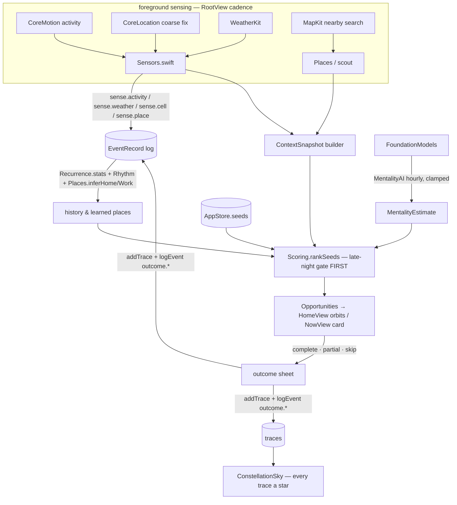
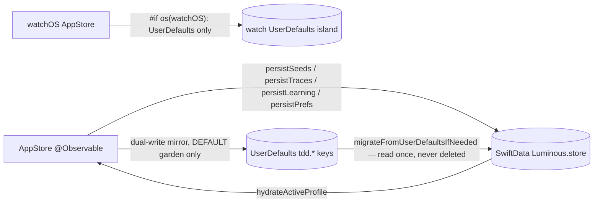

# BRAIN.md — the complete handoff brain for 《今天别消失》 (Luminous)

*Written 2026-07-04 on branch `ios-aware` (worktree `wt-aware`), tip `cd8991a`.
This is the single document that lets a fresh agent or human on a brand-new
machine continue this project with zero context loss. Everything in here was
verified against the working tree at the commit above; session-only knowledge
(device IDs, signing, battle-tested incantations, decisions and their reasons)
that exists in NO other file is written down here verbatim.*

---

## Table of contents

1. [Read me first](#1-read-me-first)
2. [Machine / environment setup from zero](#2-machine--environment-setup-from-zero)
3. [The command book](#3-the-command-book)
4. [Repo & branch map](#4-repo--branch-map)
5. [Architecture deep-dive](#5-architecture-deep-dive)
6. [File-by-file reference](#6-file-by-file-reference)
7. [Feature handbook](#7-feature-handbook)
8. [The dated project timeline](#8-the-dated-project-timeline)
9. [Decisions log (what + why)](#9-decisions-log-what--why)
10. [Traps & gotchas](#10-traps--gotchas)
11. [User preferences & collaboration protocol](#11-user-preferences--collaboration-protocol)
12. [Backlog & open questions](#12-backlog--open-questions)
13. [First hour on a new machine — checklist](#13-first-hour-on-a-new-machine--checklist)

---

# 1. Read me first

## 1.1 What this project is

《今天别消失》 / *Today Don't Disappear* is an AI **life-anchor** app — explicitly
**NOT** a todo/productivity app. The user drops a soft wish (a **Seed**, e.g.
"想学一点法语" / "想去看海"), and the app hands it back **at the right moment**
— sensed from time, energy, mood, motion, weather, nearby places — so that
today didn't completely disappear. Completing a tiny piece counts. Skipping
never shames. The product exists in two bodies:

- **Web app** (Next.js, `main` branch) — the original; its framework-free
  domain lives in `packages/core/` (`@luminous/core`).
- **Native SwiftUI app** (iOS + macOS + watchOS from one Xcode project,
  `net/luminous/ios/`) — the current center of gravity, on branch trio
  `ios-aware` = `ios-glass` = `macos`. This document is mostly about it.

## 1.2 The philosophy in one page (non-negotiable)

From `docs/product-philosophy.md` — read it before changing any tone or copy:

- **No shame. No tasks, deadlines, streaks, priorities, or percentages.**
  `ForbiddenWords` (native `Copy.swift`; web `packages/core/copy.ts`) is a
  hard lint on every string shown to the user, including LLM output.
- **Partial always counts; skipped never "disappears."** The three outcomes
  are 完成 / 做了一点 (partial) / 先跳过 — all of them leave a trace.
- **Late night is a hard safety gate in code, never in prompts.** After
  ~23:00 the ranker never recommends going out, high-energy, or long
  actions — only tiny stop-loss / rescue moves ("今天就没有完全消失").
- **The AI never commands, never diagnoses, never professes love, never
  pushes all-night work.** Its voice is a gentle companion, not a coach.
- **Privacy:** no hardcoded API keys; only coarse context (never raw GPS,
  never biometrics) leaves the device — and in the native app nothing leaves
  the device at all (FoundationModels is on-device).
- **Product language:** the user may *say* "task / management / priority",
  but the app translates into its own voice — 手帐 (journal) not board,
  愿望/种子 (wish/seed) not task, warmth bonus not priority.

## 1.3 The core loop (must never break)

Add Seed → Now Opportunity → Complete / Partial / Skipped → Daily Trace.

- Web code path: `AddSeedFlow` → `parseSeedMock`/`draftToSeed` → `store` →
  `NowFlow` → `buildContext` → `recommend` → `buildTrace`.
- Native code path: `AddSeedView` → `SeedParser.parse` (+ optional
  `AISeedParser` LLM refinement) → `AppStore.addSeed` → `HomeView`/`NowView` →
  `ContextBuilder`/`Sensors` → `Scoring.recommend` → outcome sheet →
  `AppStore.addTrace` (+ `logEvent`) → `TracesView` / `ConstellationSky`.

## 1.4 How to use this document on a new machine

1. Read section 1 (this) and section 2 (setup), then do section 13 (the
   first-hour checklist) with your hands.
2. Keep section 3 (command book) open while working — every incantation there
   is battle-tested, with its gotcha inline.
3. Before touching code, read section 5 (architecture law) and the relevant
   entries of section 6 (file reference).
4. Before writing any user-visible sentence, re-read 1.2.
5. Sections 9–11 are the memory of *why* things are the way they are and how
   the user likes to work. Do not re-litigate settled decisions without new
   information.

Read order for the underlying sources, if you want them raw:
`docs/product-philosophy.md` → `ios/README.md` → `ios/TOUR.md` →
`BRANCHES.md` → `docs/CONTEXT.md` → `ios/CLAUDE.md` → `ios/VISION-AUDIT.md`
→ `ios/OVERNIGHT-SESSION.md`.

---

# 2. Machine / environment setup from zero

## 2.1 What you need

- **macOS** with **Xcode 26.x** (project uses iOS 26 SDK-era simulators; the
  known-good sim runs iOS 26.5) and command-line tools (`xcodebuild`,
  `xcrun simctl`, `xcrun devicectl`, `swift`).
- **Node 22** for the web side (on the original Linux/WSL box it lives at
  `~/.local/bin`; on a fresh Mac any Node ≥ 20 works for
  `npm run typecheck && npm test && npm run build`).
- Git with SSH access to `git@github.com:y344shi/luminous.git`.
- An Apple ID signed into Xcode for device deploys (see 2.4).

## 2.2 Clone + worktree layout (reproduce this exactly)

The original Mac has ONE clone plus worktrees — never multiple clones:

```bash
# The live Xcode copy (branch ios-glass) — the folder Xcode keeps open:
git clone git@github.com:y344shi/luminous.git ~/Desktop/luminous/Luminous
cd ~/Desktop/luminous/Luminous            # repo root; the app lives under net/luminous/
git checkout ios-glass

# The working worktree (branch ios-aware) — where agents actually commit:
git worktree add ../wt-aware ios-aware
# Historical/archive worktrees (recreate only if needed):
#   ../wt-macos  → macos      (stale checkout on the original machine)
#   ../wt-sense  → ios-sense  (retired direction, local-only)
#   ../wt-craft  → ios-craft  (retired direction, local-only)
```

On the original machine the paths are:

| path | branch | role |
| --- | --- | --- |
| `/Users/y344shi/Desktop/luminous/Luminous/net/luminous` | `ios-glass` | **live Xcode copy — never run branch-changing git here while Xcode is open** |
| `/Users/y344shi/Desktop/luminous/wt-aware` | `ios-aware` | current working worktree (this doc lives here) |
| `/Users/y344shi/Desktop/luminous/wt-macos` | `macos` | stale checkout @ `717995c` |
| `/Users/y344shi/Desktop/luminous/wt-sense` / `wt-craft` | `ios-sense` / `ios-craft` | archived directions |

Path shape: the repo root always contains `package.json`, `ios/`, `app/`,
`docs/` directly. On the original Mac the main checkout happens to sit at the
nested path `Desktop/luminous/Luminous/net/luminous` (folder naming only —
that path IS the repo root), while `wt-aware`'s repo root is
`Desktop/luminous/wt-aware`. On WSL the same tree lives inside a parent
monorepo at `~/foundation/dreams/seize_the_day` (subtree). When in doubt:
`git rev-parse --show-toplevel`.

## 2.3 Hardware & identifiers (session knowledge — recorded nowhere else)

**Physical iPhone** (the user's daily device; all proof-of-work installs go here):

| field | value |
| --- | --- |
| Model | iPhone 17 (`iPhone18,3`) |
| Device name | 鼠尾草盒 |
| UDID | `C14010C9-1298-5982-89F6-59B190DF65E4` |
| Hostname | `shuweicaohe.coredevice.local` |
| Pairing | paired for **wireless** `devicectl` install — works over Wi-Fi, no cable needed |
| Apple Intelligence | **enabled** — all FoundationModels features work on it (never in the sim) |

**Second registered device** (2026-07-04): "Ruby's iPhone", iPhone 17
(`iPhone18,3`), UDID `F8B38454-71F2-59DF-893E-228D32AE63D9`, hostname
`Rubys-iPhone.coredevice.local` — paired via USB (`xcrun devicectl manage pair`),
UDID registered by building with `-destination 'platform=iOS,id=<udid>'
-allowProvisioningUpdates`, then wireless installs work. Different Apple ID on
the device is irrelevant; the owner must Trust the developer profile (Settings →
General → VPN & Device Management) and enable Developer Mode. **2 of ~3 free-team
device slots now used.**

**Signing** (free personal team):

| field | value |
| --- | --- |
| Team | FREE Personal Team `S29PL5D9HM` |
| Certificate | "Apple Development: yuxuanshi152214@gmail.com (DDL4RY4YK6)" |
| How team ID was recovered | `defaults read com.apple.dt.Xcode IDEProvisioningTeamByIdentifier` |
| Free-team limits | 7-day app expiry (reinstall re-arms it), **no HealthKit** entitlement, **no CloudKit** container, ~3 registered devices |
| Paid program ($99/yr) | would unlock HealthKit + CloudKit + TestFlight — user informed, **decision pending** |

**Simulators** (UDIDs are machine-local — on a new machine run
`xcrun simctl list devices available` and substitute yours):

| field | value (original machine) |
| --- | --- |
| iPhone sim | iPhone 17 Pro, UDID `633D71AE-7D5C-4078-B2DA-1999BFC262E0`, iOS 26.5 |
| Watch sim | Apple Watch Series 11 (46mm) |
| App bundle id | `rainymushroom.Luminous` |

**Derived-data conventions** (keeps worktree builds from clobbering each other):

| build | path |
| --- | --- |
| wt-aware simulator builds | `/tmp/wtaware_dd` |
| wt-aware device builds | `/tmp/wtaware_dev` |
| (older wt-macos era) | `/tmp/wtmacos_dd`, `/tmp/wtmacos_dev` |

On a NEW machine: pick analogous `-derivedDataPath /tmp/<worktree>_dd|_dev`
paths; find your sim UDID with `xcrun simctl list`; find your device UDID with
`xcrun devicectl list devices`; pair the phone once via Xcode (Window →
Devices and Simulators → enable "Connect via network"), then `devicectl`
works over Wi-Fi.

## 2.4 Signing setup on a new machine

1. Xcode → Settings → Accounts → add the Apple ID (yuxuanshi152214@gmail.com
   personal team, or the paid team if the user has bought in by the time you
   read this).
2. First device build: pass `DEVELOPMENT_TEAM=S29PL5D9HM
   -allowProvisioningUpdates` on the `xcodebuild` command line (the project
   file does not hardcode a team for the free profile) and let Xcode mint the
   profile.
3. On the phone: Settings → General → VPN & Device Management → trust the
   developer cert on first install.
4. Remember: free team apps expire after 7 days — a re-install re-arms them.
   If the user says "the app won't open anymore", it's almost always expiry:
   rebuild + reinstall.

---

# 3. The command book

Every incantation below is battle-tested. Substitute UDIDs per section 2.3.
All commands assume `cd /Users/y344shi/Desktop/luminous/wt-aware` (or your
equivalent worktree root) unless noted.

## 3.1 The green gate (run for EVERY change, in this order)

```bash
# 1. Fast pure-core tests (SwiftPM, ~seconds, 50 tests):
cd ios && swift test

# 2. iOS simulator build:
xcodebuild -scheme Luminous -project ios/Luminous.xcodeproj \
  -sdk iphonesimulator -destination 'platform=iOS Simulator,name=iPhone 17 Pro' \
  -derivedDataPath /tmp/wtaware_dd build

# 3. At milestones also:
xcodebuild -scheme Luminous -project ios/Luminous.xcodeproj \
  -destination 'platform=macOS' build
xcodebuild -scheme "Luminous Watch App" -project ios/Luminous.xcodeproj \
  -sdk watchsimulator build
```

Gotchas:
- New pure-logic `.swift` files must be added to `ios/Package.swift`
  `sources:` or `swift test` silently won't compile them.
- New files that watch-shared files start depending on must be hand-added to
  the watch target in `project.pbxproj` (FACE-UUID pattern, section 5.7 /
  10.4) or the **watch build breaks silently** — it has done so twice.
- The web gate (when touching web files): `npm run typecheck && npm test &&
  npm run build` from the repo root (31+ vitest tests must stay green).

## 3.2 Device build + wireless install (the proof-of-work loop)

```bash
# BUILD for device — ALWAYS generic destination (see gotcha below):
xcodebuild -scheme Luminous -project ios/Luminous.xcodeproj \
  -configuration Debug -sdk iphoneos -destination 'generic/platform=iOS' \
  -derivedDataPath /tmp/wtaware_dev \
  DEVELOPMENT_TEAM=S29PL5D9HM -allowProvisioningUpdates build

# INSTALL over Wi-Fi:
xcrun devicectl device install app \
  --device C14010C9-1298-5982-89F6-59B190DF65E4 \
  /tmp/wtaware_dev/Build/Products/Debug-iphoneos/Luminous.app

# LAUNCH:
xcrun devicectl device process launch \
  --device C14010C9-1298-5982-89F6-59B190DF65E4 rainymushroom.Luminous
```

**CRITICAL gotcha — the locked phone.** Install/launch FAIL with
`kAMDMobileImageMounterDeviceLocked` / "Locked" / "device is locked" while the
phone screen is locked. The standard remedy is a retry loop every ~12 s that
greps stderr for `DeviceLocked|device is locked` and tells the user to unlock
the phone; the install succeeds on the first retry after unlock. Similarly,
building with `-destination 'platform=iOS,id=<UDID>'` fails with "developer
disk image could not be mounted" when locked — that is WHY the build step
always uses `generic/platform=iOS` and installation is a separate step.

```bash
# retry-loop sketch:
until xcrun devicectl device install app --device <UDID> <app> 2>&1 | \
      grep -qv 'DeviceLocked\|device is locked'; do
  echo '>>> please unlock the iPhone'; sleep 12
done
```

## 3.3 Simulator demo tricks

```bash
# Boot + install + launch on the sim:
xcrun simctl boot 633D71AE-7D5C-4078-B2DA-1999BFC262E0
xcrun simctl install 633D71AE-7D5C-4078-B2DA-1999BFC262E0 \
  /tmp/wtaware_dd/Build/Products/Debug-iphonesimulator/Luminous.app
xcrun simctl launch 633D71AE-7D5C-4078-B2DA-1999BFC262E0 rainymushroom.Luminous

# Shift the app's clock to NIGHT (test late-night gate / night skins) —
# env prefix, no code change:
SIMCTL_CHILD_TZ=Asia/Tokyo xcrun simctl launch <sim-UDID> rainymushroom.Luminous

# Seed 16 demo traces into the constellation sky (DEBUG-only launch arg,
# implemented by DemoSky in ConstellationSky.swift):
xcrun simctl launch <sim-UDID> rainymushroom.Luminous -demoStars

# Both combined (night sky full of demo stars):
SIMCTL_CHILD_TZ=Asia/Tokyo xcrun simctl launch <sim-UDID> \
  rainymushroom.Luminous -demoStars

# Screenshot (the proof shot):
xcrun simctl io <sim-UDID> screenshot /tmp/shot.png
```

## 3.4 Tests & project-file hygiene

```bash
cd ios && swift test                       # 50 tests, seconds
plutil -lint ios/Luminous.xcodeproj/project.pbxproj   # after ANY hand-edit
xcodebuild -list -project ios/Luminous.xcodeproj      # sanity: targets parse
grep -n FACE ios/Luminous.xcodeproj/project.pbxproj   # current watch file list
```

## 3.5 Git (the safe subset)

```bash
# Always safe anywhere: status, log, branch, diff, ls-files, rev-parse.
# Commit style (see §11): subject `aware N: <what>`; trailer:
#   Co-Authored-By: Claude Opus 4.8 <noreply@anthropic.com>

# Push the trio (run after EVERY green committed change, same cycle):
git push origin ios-aware
git push origin ios-aware:ios-glass ios-aware:macos

# Docs-only commit to the web trunk main (never merge native into main):
git worktree add /tmp/wt-main-docs origin/main   # temp worktree, Xcode-safe
#  …edit, commit…
git push origin HEAD:main
git worktree remove /tmp/wt-main-docs
```

**Hook bypass** (only with Xcode CLOSED and a clean tree — see §10.1): a
repo-local git hook blocks `merge`/`checkout` unconditionally. When a merge is
genuinely needed, the indirection that defeats the hook's string match is:

```bash
op=merge; git "$op" --ff-only origin/ios-glass
```

## 3.6 Web app (WSL / any Node box)

```bash
export PATH="$HOME/.local/bin:$PATH"   # original WSL box: node v22 lives here
npm run dev         # local dev
npm run typecheck   # tsc --noEmit — must stay clean
npm test            # vitest run — must stay green (31+ tests)
npm run build       # next build — must compile all routes
node scripts/gen-timeline.mjs          # regenerate docs/TIMELINE.md
bash scripts/shoot-home.sh <dir>       # capture docs/shots/<dir>.png
# WSL → GitHub publish (web work lives in a parent monorepo there):
git subtree push --prefix=dreams/seize_the_day luminous <branch>
```

## 3.7 MCP alternative

When the xcode-tools MCP server is connected, `BuildProject` /
`XcodeRefreshCodeIssuesInFile` are fine alternatives for builds/diagnostics.
But see §10.3: SourceKit diagnostics in a headless harness are often FALSE
for cross-file references — `xcodebuild` is the only truth.

---

# 4. Repo & branch map

## 4.1 The one-paragraph story (from BRANCHES.md, verified against `git branch -a`)

`main` is the **web trunk** (Next.js), fed historically by the WSL machine via
`git subtree push`. On 2026-06-28 the native SwiftUI app was born **on top of
main** — the three native branches are a clean **descendant** of main
(merge-base = main's web tip `b23574e`), not a fork. Native work happens in
git **worktrees** (one folder per branch; never switch branches under the open
Xcode project), and after every green change the three native branches are
**fast-forwarded together** so they always share one tip.

## 4.2 Branch table (tips as of 2026-07-04, `cd8991a` = BRANCHES.md docs commit)

| branch | role | local tip | remote tip | checked out at |
| --- | --- | --- | --- | --- |
| `main` | **web trunk** — Next.js + `@luminous/core` | `02505d9` (local, stale) | `8ee94d9` | WSL: `~/foundation/dreams/seize_the_day` |
| `ios-glass` | **native trunk** — canonical branch for iOS/macOS/watchOS | `cd8991a` | `cd8991a` | Mac live Xcode copy `net/luminous` (pull only with Xcode **closed**) |
| `ios-aware` | native **working branch** — commits land here first | `cd8991a` | `cd8991a` | Mac worktree `wt-aware` |
| `macos` | native mirror (historical name from the 3-platform port) | `717995c` (stale local) | `cd8991a` | Mac worktree `wt-macos` (stale checkout) |
| `ios-sense` / `ios-craft` | retired design directions, **local-only** | `994da4c` / `3656884` | — | `wt-sense` / `wt-craft` (archive) |
| `glass` | old web glass direction | `e49d2f5` | — | (none) |
| remote | `git@github.com:y344shi/luminous.git` (origin) | | | |

**Invariant:** `ios-aware == ios-glass == macos` **on the remote at all
times**. Push new work to `ios-aware`, then
`git push origin ios-aware:ios-glass ios-aware:macos`. If they ever differ,
`ios-glass` wins (it's the trunk). The local `macos`/`main` checkouts being
stale is fine — the remote is the source of truth.

**main vs native:** native contains *all* of main up to `b23574e`
(*core 43*, 2026-06-29 — the web app compiles from any native branch). main does **not** contain the ~120 native commits. **Never
merge native → main wholesale.** Docs-only commits to main are OK via a temp
worktree + `git push origin HEAD:main`. WSL note from BRANCHES.md: main now
carries GitHub-side doc commits, so before the next `git subtree push` from
WSL, run `git subtree pull --prefix=dreams/seize_the_day luminous main` to
reconcile subtree histories.

## 4.3 Repo layout (root = a Next.js app + the native app inside it)

```
<repo root>                    (in wt-aware this is the worktree root)
├── app/                       Next.js routes (6): add, now, traces, garden, seed, settings
├── components/                web UI by feature; AppProvider hydrates store
├── lib/                       web platform boundary: store (Zustand), storage, feedback…
├── packages/core/             @luminous/core — framework-free domain (web twin of ios pure core)
├── tests/                     Vitest (incl. corePurity.test.ts boundary guard)
├── docs/                      living web/product docs + THIS FILE
├── scripts/                   gen-timeline.mjs, shoot-home.sh, …
├── prisma/, public/           web leftovers
└── ios/                       ★ the native app (see §5–§6)
    ├── Luminous/              all app + shared source (~9,000 lines Swift)
    ├── LuminousWatch/         watch-only UI (2 files)
    ├── CoreTests/             SwiftPM pure-core tests (8 files, 50 tests)
    ├── Package.swift          the SwiftPM test-harness manifest (sources: list!)
    ├── Luminous.xcodeproj/    project — hand-edited watch refs (FACE UUIDs)
    ├── *.md                   README, TOUR, CLAUDE, VISION-AUDIT, OVERNIGHT-SESSION,
    │                          PLANETARIUM-PHYSICS, MAC-SESSION-NOTES, MUSIC-CREDITS
    └── shots/                 proof screenshots
```

---

# 5. Architecture deep-dive

## 5.1 THE LAW (pin this on the wall)

> **The linear scorer is the auditable spine. Every intelligence source
> contributes exactly ONE clamped additive term. Hard gates (late-night)
> live in CODE, never in prompts. Every LLM feature is: `@Generable`
> structured output + a deterministic fallback + `ForbiddenWords.passes`
> on anything shown. "The LLM decides content; code decides truth and
> safety."**

Current clamp budget (all verified in `Scoring.swift` / contributors):

| term | source | clamp / size |
| --- | --- | --- |
| sensor fusion (motion/ambient/arousal) | `Scoring.sensorBonus` | **±0.25** |
| nearby fitting place | `Scoring.placeBonus` | **+0.12** flat (0 late-night) |
| history / recurrence (incl. +0.05 journal-engagement warmth) | `Recurrence.historyBonus` | **±0.15** |
| mentality estimate (hourly LLM mood guess) | `Mentality.bonus` | **±0.2** |
| trigger conditions | `Scoring.triggerBonus` | itemized, ±0.3 worst case |
| late-night rescue boost | inline in `scoreSeed` | +0.5 (only when `isLateNight && isRescueSeed`) |

Three CoreTests pin the late-night gate specifically; the SwiftPM suite (50
tests) is the fast guardian of all of this. Any new signal = one new clamped
additive term + a test. Never multiply terms, never let a prompt gate safety.

## 5.2 The scoring spine, term by term (Scoring.swift, verified)

Base weighted sum (`scoreSeed`):

```
total = timeFit*0.2 + durationFit*0.2 + energyFit*0.2 + locationFit*0.2
      + moodFit*0.1 + freshness*0.05 + serendipity*0.05
      + triggerBonus + sensorBonus + placeBonus
      + Recurrence.historyBonus + Mentality.bonus
      + (isLateNight && isRescueSeed ? 0.5 : 0)
→ clamped to [0, 2]
```

Individual fits (exact values):

- `timeFit`: no preferred times → 0.6; contains current `semanticTime` (or
  `.weekend` on weekends) → 1; else 0.3.
- `durationFit`: unknown free minutes → 0.6; `free >= estimated` → 1;
  `free >= estimated/3` → 0.65; `free >= 5` → 0.35; else 0.1.
- `energyFit`: have ≥ need → 1; short by exactly one rank → 0.4; else 0.1.
  (`energyRank`: low 0, medium 1, high 2.)
- `locationFit`: seed `.anywhere` → 1; hint nil/unknown → 0.45 for
  downtown/outdoor seeds else 0.6; exact match → 1; computer↔home → 0.8;
  mismatch → 0.2.
- `moodFit`: mood has no affinity list → 0.6; category overlap with
  `moodAffinity[mood]` → 1; else 0.3. Affinities: empty→[recovery,
  connection, body, aesthetic]; tired→[body, recovery]; anxious→[body,
  recovery, exploration]; okay→[learning, creation, exploration, aesthetic];
  alive→[exploration, aesthetic, creation]; avoidant→[creation, learning];
  lonely→[connection, recovery, body]; wantLove→[connection, recovery, body];
  unknown→[].
- `freshness`: sleeping 0.5, active 1, other 0.
- `serendipity`: `rng()` if injected (tests), else **stable hash**
  `stableSerendipity(seed.id, ctx.semanticTime.rawValue)` — djb2 over
  `"\(seedId)|\(slot)"`, `h % 10_000 / 10_000`. This is decision #6: it used
  to be re-rolled per render and made rankings jitter.

`triggerBonus` (exact, additive within itself):

| trigger string on seed | condition | bonus |
| --- | --- | --- |
| `avoidant_mood` | mood == avoidant | +0.18 |
| `lonely` | mood == lonely | +0.18 |
| `want_love` | mood ∈ {wantLove, lonely} | +0.18 |
| `low_energy_ok` | energy == low | +0.06 |
| `short_free_time` | freeMinutes ≤ 15 | +0.08 |
| `free_time_15min` | freeMinutes ≥ 15 | +0.04 |
| `weather_good` | isOutdoorWeatherGood == true | +0.10 |
| `near_outdoor` | locationHint == outdoor | +0.10 |
| `at_computer` | deviceContext?.isAtComputer == true | +0.06 |
| `late_night` / `rescue_mode` | isLateNight | +0.20 |
| `not_late_night` | isLateNight | **−0.30** |

`sensorBonus` (clamped ±0.25 via `DomainUtil.clamp(b, -0.25, 0.25)`):

- activity `.transit`: ≤10-min seeds +0.1; focus(learning/creation)+computer
  −0.12; recovery/body +0.05.
- activity `.walking`: outdoor seed or exploration/body category +0.1.
- activity `.still`: focus +0.05.
- ambient `.quiet`: focus or aesthetic +0.1. `.lively`: connection +0.1,
  recovery +0.05, focus −0.06.
- arousal `.elevated`: recovery/body +0.12; high energy or exploration −0.08.
  `.calm`: focus +0.06.

`placeBonus`: 0 when `ctx.isLateNight` (hard gate) or no `nearbyKinds`;
+0.12 when any seed category's `placeAffinity` intersects nearby kinds.
`placeAffinity` (SeedCategory → PlaceKind set): learning→{library, cafe,
museum}; creation→{library, cafe, nature}; connection→{cafe, restaurant,
attraction}; exploration→{store, market, museum, attraction, nature};
aesthetic→{park, museum, cafe, nature, attraction}; body→{park, gym,
nature}; recovery→{cafe, park, nature}.

**The late-night hard gate** (`rankSeeds`): when `ctx.isLateNight`, the
candidate list is filtered to seeds passing `!isUnsafeLateNight(seed)`
(falls back to unfiltered only if NOTHING is safe). `isUnsafeLateNight`
returns false (safe) for seeds carrying `late_night`/`rescue_mode` triggers;
otherwise unsafe if: locationType outdoor/downtown, OR category exploration,
OR energyRequired high, OR estimatedDurationMin > 20. Rescue seeds
(`isRescueSeed`) also include low-energy ≤15-min body/recovery seeds, and get
the +0.5 late-night boost. Late-night `buildReason` always returns the fixed
stop-loss line 「现在已经很晚了，这是一个不费力的止损动作。完成它，今天就没有完全消失。」

`recommend(...)` maps ranked seeds → `Opportunity(id: uid("opp"), seedId,
score, reason, suggestedAction: seed.minimumAction, notificationText:
"title · minimumAction", createdAt)`. Default `limit: 3`.

## 5.3 Data flow (native)



Persistence flow:



## 5.4 SwiftData schema (Persistence.swift, verified)

Design rules (decision #1/#2): **hybrid payload-JSON records** — a few
queryable columns + a `payload` JSON blob of the existing Codable struct, so
struct evolution never forces a SwiftData migration. **CloudKit-ready
shape**: every property has a default, no `@Attribute(.unique)`, no
relationships; profile scoping via a plain `profileID` string column.

| @Model | queryable columns | payload |
| --- | --- | --- |
| `ProfileRecord` | `uuid`, `name`, `createdAt` | `prefsPayload` = JSON `ProfilePrefs` |
| `SeedRecord` | `seedID`, `profileID`, `status`, `updatedAt` | JSON `Seed` |
| `TraceRecord` | `traceID`, `profileID`, `date` (YYYY-MM-DD) | JSON `DailyTrace` |
| `LearningRecord` | `entryID`, `profileID`, `dateKey` | JSON `LearningEntry` |
| `NoteRecord` | `noteID`, `profileID`, `seedID` | JSON `PursuitNote` (手帐) |
| `EventRecord` | `eventID`, `profileID`, `timestamp`, `kind` | `payloadJSON` (kind-specific) + `contextJSON` (ContextSnapshot or "") |

`ProfilePrefs` (one evolvable blob instead of 10 scattered keys): `settings`,
`lastPick`, `samplesPlanted`, `introSeen`, `aesthetic`, `aestheticAuto`,
`senseAround`, `learnedVocab: [String: [String]]`, `musicOn`.

Controller facts (`@MainActor final class Persistence`):
- `static let shared: Persistence?` — optional! nil → Store falls back to
  pure UserDefaults. `static let defaultProfileName = "我的花园"`.
- Store file: `<Application Support>/Luminous.store`.
- **Self-healing open**: if `ModelContainer` fails (dev-time schema drift),
  delete the store file and retry ONCE; loss-free because the UserDefaults
  mirror is still dual-written and migration re-imports it (decision #2/#3).
- Collections are **whole-collection replace** (`replaceSeeds/Traces/
  Learning`) — data is tiny; notes and events are insert/append-only.
- `appendEvent(kind:payload:context:profile:)` stamps `Date.now` + optional
  ContextSnapshot JSON.
- `events(profile:since:kindPrefix:)` fetches sorted by timestamp then
  filters in memory.
- `pruneEvents(olderThan days: Int = 90, profile:)` — raw events have a
  90-day retention; aggregates keep the memory.
- `migrateFromUserDefaultsIfNeeded(defaults:) -> String` returns the active
  profile UUID; on first run creates 我的花园 and imports every `tdd.*` key —
  **reads but never removes them** (rollback path).

## 5.5 The event-log kinds taxonomy (grep-verified against all `logEvent` call sites)

| kind | payload | logged from | meaning |
| --- | --- | --- | --- |
| `sense.activity` | ActivityState rawValue (`still`/`walking`/`transit`) | RootView sensing cadence | motion transition observed |
| `sense.weather` | weather rawValue | RootView | sensed weather changed |
| `sense.place` | place summary | RootView | nearby place kinds observed |
| `sense.cell` | coarse grid-cell string | RootView | coarse location cell fix (feeds `Places.inferHome/Work`) |
| `outcome.<kind>` | seed id | NowView outcome + HomeView outcome sheet | wish outcome; `<kind>` = the outcome enum case (done/partial/skipped family) — substrate for `Recurrence.stats` |
| `trace.recorded.full` / `trace.recorded.partial` | trace's seedId or "" | `AppStore.addTrace` | a trace was written |
| `seed.planted` | seed **title** | `AppStore.addSeed` | new wish planted |
| `seed.status.<status>` | seed id | `AppStore.setSeedStatus` | status change (`active`/`sleeping`/`completed`/…) |
| `pursuit.note` | seed id | `AppStore.addNote` | a 手帐 note was written (drives the +0.05 `engagedRecently` warmth within the ±0.15 history clamp, looking back 7 days) |
| `plan.made` | seed id | PlanView | a task-breakdown plan was made |
| `plan.recipe` | dish name | RecipeExecutor | recipe deep-assist used |

Consumers: `AppStore.seedHistory()` (reads `outcome.` + `pursuit.` →
`Recurrence.SeedStats`), `AppStore.learnedPlaceCells()` (reads `sense.cell` →
home/work inference), `AppStore.todayDwellLine()` (reads today's
`sense.activity` → `Rhythm.todayLine`).

## 5.6 The Store (AppStore, Store.swift — the single stateful glue)

`@Observable final class AppStore` — iOS analogue of the web `lib/store.ts` +
`lib/storage.ts`. Key facts:

- Persisted state: `seeds`, `traces` (cap `maxTraces = 500`), `settings`,
  `samplesPlanted`, `lastPick` (`LastPick { mood, energy }`), `introSeen`,
  `aesthetic`, `aestheticAuto` (follow system: Dark→glass, Light→paper),
  `senseAround` (opt-in gate for location/weather; motion is permission-free
  and always on), `learnedVocab` (per-language, capped 200/lang),
  `learningHistory` (`[LearningEntry]`, capped 300), `musicOn`.
- Transient: `opportunities`, `lastContext`, `mentality` +
  `mentalityFetchedAt` (hourly refresh dedupe).
- UserDefaults keys all under `tdd.*` (`Key.all` lists 12), parallel to the
  web app's localStorage keys.
- `#if !os(watchOS)`: `persistence: Persistence?`, `activeProfileID`,
  `mirrorsToDefaults` — the **dual-write** flag, true only for the FIRST
  (migrated, default) profile. Watch builds compile the pure-UserDefaults
  paths only → **zero pbxproj risk from Persistence.swift** (decision #3).
- Hydration: `hydrate()` → SwiftData path (`migrateFromUserDefaultsIfNeeded`
  → `hydrateActiveProfile`, which also runs the 90-day event prune) or
  `hydrateFromDefaults()` (watch / container-failure fallback). First run
  plants `MockGarden.seed()` so the app never feels empty.
- Gardens: `gardens`, `createGarden(name:)` (empty → "新的花园"),
  `switchGarden(id:)` (re-hydrates everything; clears transient state; only
  the default garden keeps mirroring).
- Learning: `learnedWords(_:)`, `addLearnedWords(_:language:)`,
  `logLearning(_:)`, `learningEntries(language:)`, `learningSeeds`
  (via `LearningTopic.isLearning`), and
  `mergeLearningSeed(newRaw:into:) -> String?` — folds a new wish into an
  existing learning anchor: reactivates it, appends the raw text to the
  description, logs a `LearningEntry` (kind `.vocab`, note 「又添了一句：…」).
- 手帐: `notes(for:)`, `addNote(_:to:kind:)` (trims; logs `pursuit.note`;
  bumps `noteBump` so views re-read — notes are NOT mirrored in memory),
  `removeNote(_:)`.
- `effectiveAesthetic(dark:)` = auto ? (dark ? .glass : .paper) : aesthetic.
- `resetAll()` wipes only the ACTIVE profile's records (+ the tdd.* mirror
  when it's the default garden) and replants the mock garden.

## 5.7 Target membership model (the #1 build-breaking trap)

Three compilation worlds share `ios/Luminous/*.swift`:

1. **App target (iOS/macOS)** — membership via
   `PBXFileSystemSynchronizedRootGroup`: ANY new `.swift` under
   `ios/Luminous/` joins automatically. Nothing to do.
2. **Watch target** — does NOT use the synchronized group. Watch-shared
   files are hand-listed in `project.pbxproj` with **FACE-prefixed fake
   UUIDs** (pattern: fileref `FACE00000000000000000X10`, buildfile
   `FACE00000000000000000X20`; each new file needs a PBXFileReference + a
   PBXBuildFile + an entry in the group `children` + in the watch target's
   Sources build phase). If a watch-shared file (Store/Scoring/Domain/…)
   gains a dependency on a type in a file NOT in that list, the watch build
   **breaks silently** (it broke twice: `LearningLog`, then
   `Recurrence`/`Mentality`). Check the list: `grep FACE project.pbxproj`.
   After hand-editing: `plutil -lint` + `xcodebuild -list`.
3. **SwiftPM test package** (`ios/Package.swift`) — compiles ONLY the files
   named in its `sources:` array. New pure-logic files need one line there
   or `swift test` won't see them.

Rule of thumb: pure domain files (no SwiftUI import) go in all three; UI
files stay app-only; `Persistence.swift` is deliberately **not** in the watch
target (`#if os(watchOS)` guards in Store keep the watch on UserDefaults).

---

# 6. File-by-file reference

Target legend: **A** = app target (iOS/macOS, automatic via synchronized
group), **W** = watch target (hand-listed FACE refs), **P** = SwiftPM test
package (`Package.swift` `sources:`).

## 6.0 Overview (all of `ios/Luminous/`, with line counts at `cd8991a`)

| file | lines | targets | one-line purpose |
| --- | --- | --- | --- |
| Domain.swift | 229 | A W P | core domain types (Seed, ContextSnapshot, Trace, enums, DomainUtil) |
| SemanticTime.swift | 81 | A W P | hour → semantic time; ContextBuilder |
| Copy.swift | 239 | A W P | all UI copy, category meta, **ForbiddenWords**, pickers |
| SeedParser.swift | 274 | A W P | keyword parser, MockGarden, TraceGenerator |
| Scoring.swift | 324 | A W P | **the recommender spine** (see §5.2) |
| SensorClassifiers.swift | 53 | A P | pure motion/ambient/arousal/weather classifiers |
| Rhythm.swift | 116 | A P | dwell segments, hour-of-week histograms, today-line |
| Recurrence.swift | 103 | A W P | per-seed cadence stats + historyBonus (±0.15) |
| Places.swift | 84 | A P | ~150 m grid cells; home/work inference; location hint |
| PlanKit.swift | 116 | A P | plan validation + deterministic fallback; WishTopics; LanguageScenarios |
| Mentality.swift | 57 | A W P | MentalityEstimate + bonus (±0.2) |
| Nudge.swift | 117 | A P | pure NudgeGate + platform Nudger |
| Suggestion.swift | 157 | A P | Suggestion type, Suggester pool, OpportunityScout |
| Store.swift | 564 | A W | AppStore — the single stateful glue (§5.6) |
| Persistence.swift | 358 | A | SwiftData layer (§5.4) — **not** in watch |
| LearningLog.swift | 152 | A W | LearningEntry/Topic/Merge (the LearningMerge pattern) |
| DayGrade.swift | 51 | A W | hour → day phase, sky palette, poetic line |
| Theme.swift | 128 | A W | 5 theme token sets + Spacing/Radius + Color.hex |
| Aesthetic.swift | 55 | A W | skin enum (glass/ocean/paper) |
| Feedback.swift | 29 | A W | completion haptics |
| Sensors.swift | 309 | A | platform sampler: motion/location/weather/POI |
| AILesson.swift | 98 | A | AIHelper availability gate + vocab generator |
| AISeedParser.swift | 88 | A | LLM seed parse with keyword fallback |
| SuggestAI.swift | 101 | A | LLM reason-rewriter + moment suggestions |
| MentalityAI.swift | 79 | A | hourly LLM mentality refresh (AppStore extension) |
| TaskPlannerAI.swift | 64 | A | LLM 2–4-step plan proposer |
| Translate.swift | 120 | A | Vision OCR + LLM translation engine |
| WeekReview.swift | 95 | A | weekly-review card (LLM, silence fallback) |
| LuminousApp.swift | 17 | A | @main entry |
| ContentView.swift | 20 | A | legacy alias → RootView |
| RootView.swift | 135 | A | tab shell, sensing lifecycle, nudges, music, -demoStars |
| HomeView.swift | 1010 | A | planetarium home (the biggest file) |
| NowView.swift | 314 | A | the 4-step Now flow + AppRouter |
| AddSeedView.swift | 158 | A | catch-a-wish flow + merge |
| GardenView.swift | 205 | A | garden list + seed detail |
| TracesView.swift | 115 | A | trace journal |
| SettingsView.swift | 419 | A | skins/music/sensing/themes/nudges/gardens/reset |
| PlanView.swift | 224 | A | plan section + per-step resources |
| PursuitPage.swift | 232 | A | 手帐 journal page + growth ideas |
| TranslateView.swift | 275 | A | photo-translate UI |
| ExecutorViews.swift | 301 | A | executor router, ReviewQuiz, SparkLine, Breath |
| RecipeExecutor.swift | 198 | A | cooking deep-assist |
| OpportunityCard.swift | 63 | A | Now-flow opportunity card |
| DesignKit.swift | 263 | A | SoftButton/BreathingCard/Chips/FlowLayout/… |
| SceneBackground.swift | 200 | A | day-graded sky/sea backdrop + weather overlays |
| ConstellationSky.swift | 232 | A | 记忆星座 + DemoSky + BirthOverlay |
| OrbitSim.swift | 149 | A | velocity-Verlet gravity sim |
| AestheticField.swift | 28 | A | skin → backdrop dispatcher |
| PaperField.swift | 47 | A | ruled-notebook backdrop |
| SkinMusic.swift | 70 | A | per-skin looping ambient music |
| RouteFinder.swift | 35 | A | MKDirections walking route |
| ocean.mp3 / paper.mp3 / planetarium.mp3 | — | A | CC BY theme tracks (see MUSIC-CREDITS.md) |

## 6.1 Pure domain core

### Domain.swift — types everything else stands on
- `enum SeedCategory: String, Codable, CaseIterable, Hashable` — `body,
  creation, connection, exploration, recovery, learning, aesthetic`.
- `enum Energy` — `low, medium, high`. `enum Mood` — `empty, tired, anxious,
  okay, alive, avoidant, lonely, wantLove = "want_love", unknown`.
- `enum SemanticTime` — `morning, lunch, afternoon, afterWork = "after_work",
  evening, lateNight = "late_night", weekend, transit`.
- `enum LocationType` — `anywhere, home, work, outdoor, downtown, computer,
  transit, unknown`. `enum SeedStatus` — `active, sleeping, completed,
  archived`.
- Sensed enums: `Activity { still, walking, transit }`, `Ambient { quiet,
  lively }` (mic — "never recorded"), `Arousal { calm, elevated }`
  (HealthKit seam), `WeatherKind { clear, clouds, rain, snow, fog, unknown }`,
  `PlaceKind { cafe, library, park, market, store, restaurant, gym, museum,
  attraction, nature }`.
- `enum ThemeName` — `warmPaper = "warm_paper", duskGarden = "dusk_garden",
  minimalIos = "minimal_ios", fieldNotebook = "field_notebook",
  softRitual = "soft_ritual"`.
- `struct Seed` — `id, rawText, title, description?, categories,
  minimumAction, estimatedDurationMin, energyRequired, locationType,
  preferredTimes, triggerConditions: [String], status, createdAt, updatedAt`.
- `struct ContextSnapshot` — `timestamp, semanticTime, mood, energy,
  freeMinutes?, isLateNight, isWeekend?, isOutdoorWeatherGood?,
  locationHint?, deviceContext?` + sensed `activity?, ambient?, arousal?,
  weatherKind?, nearbyKinds: [PlaceKind]?`.
- `struct Opportunity` — `id, seedId, score, reason, suggestedAction,
  notificationText, createdAt`.
- `struct PursuitNote` — 手帐 entry, "never a subtask": `id, seedId,
  dateKey, kind (enum Kind { note, idea, aiIdea }), text`;
  `init(seedId:kind:text:)` mints `uid("pnote")` + today's dateKey.
- `struct DailyTrace` — `id, date (YYYY-MM-DD), seedId?, opportunityId?,
  text, category?, partial: Bool?, createdAt`.
- `struct Settings` — `theme, aiMode ("mock"|"real"), quietHoursStart,
  quietHoursEnd, maxRemindersPerDay, nudgesEnabled`. Default:
  `warmPaper / "mock" / 23 / 8 / 3 / false`.
- `enum DomainUtil` — `uid(_ prefix:) -> String` (base36 ms + 8 uuid chars,
  so ids sort by time), `nowIso()`, `localDateKey(_:)` (LOCAL, not UTC),
  `clamp(_:_:_:)`, `friendlyDate(_:today:)` (今天/昨天/前天/M月D日).

### SemanticTime.swift — the clock made semantic
- `TimeOfDay.semanticTime(fromHour:isWeekend:)` — **late night = 23:00–04:59
  and beats weekend**; then <11 morning, <14 lunch, <17 afternoon, <19
  afterWork, else evening.
- `TimeOfDay.isLateNight(hour:)` — `hour >= 23 || hour < 5`. The single
  definition every gate uses.
- `struct ContextInput` (mood, energy, freeMinutes?, locationHint?,
  isOutdoorWeatherGood?, now, isMobile, isAtComputer?, sensed fields,
  nearbyKinds) + `ContextBuilder.build(_:) -> ContextSnapshot` (empty
  nearbyKinds → nil).

### Copy.swift — the voice, centralized
- `enum Copy` namespaces: `Intro/Home/Add/Garden/SeedDetail/Now/Completion/
  Traces/SettingsCopy/LateNight/Tab`. Anchors: `appTitle = "今天别消失"`,
  `tracePrefix = "今天没有消失，因为"`, `Completion.skippedMsg =
  "没关系。愿望还在，等下一个契机。"`, `LateNight.title = "现在已经很晚了。"`.
- `Meta.category` (身体🍵 创造✏️ 连接🤍 探索🚶 恢复🫧 学习📓 审美🌿),
  `Meta.energyLabel`, `Meta.durationLabel(_:)` (≤5 几分钟 … >60 可长可短).
- **`ForbiddenWords.all`** = `["待办", "任务列表", "完成任务", "todo",
  "to-do", "deadline", "overdue", "高优先级", "优先级", "完成率", "streak",
  "打卡", "失败", "you must", "you failed"]`;
  `ForbiddenWords.passes(_ text: String) -> Bool` — lowercased substring
  check; **every LLM output shown to the user must pass this**.
- `Pickers.mood/energy/free/location` — the Now-flow chip options
  (free: 5/15/30/90/nil "不知道").

### SeedParser.swift — keyword parser + mock garden + trace text
- `struct SeedTemplate` / `typealias SeedDraft = SeedTemplate`.
- `MockGarden.templates` — 8 first-run seeds (法语单词, 野外, 市中心, 热饭,
  理解一个模块, 方向盘, 发一句真话, 深夜止损 — the last with
  `triggers ["late_night","rescue_mode"]`), `materialize(_:)`, `seed()`.
- `SeedParser.parse(_ raw: String) -> SeedDraft` — 8 regex rules
  (法语/野外/市中心/热饭/代码/朋友/拍照/睡-止损), all matches accumulate
  categories, earlier rules win single fields; defaults `.anywhere / .low /
  10 min / [.evening] / ["short_free_time"]`; no match → `[.recovery]` +
  "做最小的一步，做到一点也算". `titleFromText` strips `我想/要/希望/得/该`,
  first clause, `prefix(16)`.
- `SeedParser.draftToSeed(_:) -> Seed` — mints `uid("seed")`, `.active`.
- `enum CompletionKind: String { completed, partial, skipped }`.
- `TraceGenerator.generateText(_:_:)` (per-category completion lines;
  partial line chosen by `seed.id.count % 3` — deterministic),
  `buildTrace(_:_:opportunityId:date:)`, `buildRestTrace(...)` ("你及时停下来
  了。" — choosing to stop is itself a real act).

### Scoring.swift — see §5.2 for the full spine
Key API: `Scoring.rankSeeds(_ seeds:_ ctx:rng:history:mentality:limit:) ->
[ScoredSeed]`, `Scoring.recommend(...) -> [Opportunity]`,
`Scoring.scoreSeed(...) -> ScoreBreakdown`, `Scoring.triggerBonus`,
`Scoring.sensorBonus` (±0.25), `Scoring.placeBonus` (+0.12),
`Scoring.placeAffinity: [SeedCategory: Set<PlaceKind>]` (also used by the
scout, HomeView badges, PlanView route resource),
`Scoring.isUnsafeLateNight(_:)`, `Scoring.stableSerendipity(_:_:)`.
`typealias Rng = () -> Double` — injectable for deterministic tests.

### SensorClassifiers.swift — pure classifier half of sensing
- `Sensors.classifyActivity(_ magnitudes: [Double]) -> Activity?` — needs
  ≥4 samples; mean-abs-deviation `<0.6` still, `<3.5` walking, else transit.
- `Sensors.classifyAmbient(_ rms: Double) -> Ambient` — `>= 0.08` lively.
- `Sensors.classifyArousal(_ bpm: Double, resting: Double = 70) -> Arousal`
  — `bpm >= resting + 18` elevated.
- `Weather.classify(code:)` — WMO: 0–1 clear, 2–3 clouds, 45/48 fog,
  51…67/80…82/95…99 rain, 71…77/85/86 snow.
- `Weather.isGoodOutdoor(kind:tempC:)` — (clear|clouds) && 8…30 °C.
Ported verbatim from `@core/sensors` + `@core/weather` — thresholds pinned
by tests on both platforms.

### Rhythm.swift — the day's shape from the event log
- `struct SenseSample { time, state }`, `struct DwellSegment { state, start,
  minutes }`.
- `Rhythm.segments(_:now:capMinutes: 120)` — each state holds until the next
  sample; **cap 120 min** so a dead app never fabricates a huge dwell.
- `Rhythm.minutesByState(_:from:to:)`, `Rhythm.hourOfWeek(_:calendar:)` —
  state → 168 Monday-based hour bins (`binIndex = ((weekday+5)%7)*24+hour`).
- `Rhythm.todayLine(_:now:calendar:)` — "今天到现在：安坐 3 小时 · 走动 40
  分钟"; only states ≥5 min; nil when nothing (say nothing); never a "%".

### Recurrence.swift — the tree reads its own rings
- `struct Outcome { time, seedId, kind (completed|partial|skipped),
  semanticTime? }`.
- `Recurrence.SeedStats` — `completions` (partial counts!), `lastDone?`,
  `medianGapDays?`, `modalDoneTime?`, `skipsByTime`, `doneByTime`,
  `engagedRecently` (手帐 touched this week).
- `Recurrence.stats(_ outcomes:) -> [String: SeedStats]` — median gap needs
  ≥2 done dates (upper median).
- `Recurrence.historyBonus(_ seed:_ ctx:stats:now:)` — clamp ±0.15:
  sleeping-and-due `+min(0.15, 0.08 + 0.02·(since/gap))`; modal-time match
  `+0.05`; `skips >= 3 && dones == 0` in this semanticTime `−0.1` ("wrong
  moment, not wrong wish"); `engagedRecently +0.05`.

### Places.swift — home/work learned from coarse cells
- `Places.cellSize = 0.0015`° (≈165 m); `cellKey(lat:lon:)` quantizes and
  formats `%.4f,%.4f` — **only the cell key is ever logged, never a raw
  coordinate**; raw events age out at 90 days (enforced by Persistence).
- `inferHome(_ obs:minCount: 5)` — modal cell of night obs (22:00–06:00),
  needs ≥5 sightings ("one late evening out never becomes home").
- `inferWork(_ obs:home:minCount: 5)` — modal weekday (Mon–Fri) 9–18 cell;
  nil if == home (WFH reads as home).
- `hint(currentCell:home:work:activity:)` — transit > home > work > outdoor
  > unknown precedence.

### PlanKit.swift — plans validated by code, proposed by the LLM
- `enum PlanResource: String { route, vocab, photo, breath, none }` — the
  CLOSED resource set (unknown strings from the LLM are dropped).
- `struct PlanStep { title (≤24 chars), resource, detail (≤16 chars) }`.
- `PlanKit.validate(_ raw: [(title:resource:detail:)]) -> [PlanStep]?` —
  trims, caps, `ForbiddenWords.passes(title+detail)`, closed-set resource,
  dedupe, max 4; **nil unless ≥2 survive** → caller uses fallback.
- `PlanKit.fallback(for seed:) -> [PlanStep]` — never empty: step 1 is
  always `seed.minimumAction`; learning adds vocab+photo; exploration/body/
  outdoor adds route; recovery adds breath; `prefix(4)`.
- `WishTopics.isCooking(_:)` — keyword list (做饭/做菜/下厨/煮/烤/炒/食谱/
  cook/recipe/bake/dinner…) that routes to RecipeExecutor.
- `LanguageScenarios.options(nearby:activity:hour:)` — deterministic vocab
  themes from the sensed moment (餐厅→点餐与食物, 移动→出行与问路,
  图书馆→阅读与展览, 晚间→日常寒暄, 早晨→早晨的问候); ≤3, never empty.

### Mentality.swift — soft guess, one clamped tilt
- `struct MentalityEstimate { restlessness, depletion, openness }` — each
  0…1, **neutral 0.5**, init clamps.
- `Mentality.bonus(_ seed:estimate:)` — clamp ±0.2; only deviations ABOVE
  0.5 act: depletion → recovery/body `+d·0.3`, learning/creation `−d·0.2`,
  high-energy `−d·0.3`; restlessness → body/exploration `+r·0.25`,
  >30 min `−r·0.2`; openness → exploration/creation/connection `+o·0.25`.
  Nil/neutral estimate contributes exactly 0.

### Nudge.swift — restraint as architecture
- Pure `NudgeGate`: `struct Input { nudgesEnabled, quietStart, quietEnd,
  maxPerDay, sentToday, hour }`; `inQuietHours(hour:start:end:)` wraps
  midnight (start==end → never quiet); `allows(_:)` requires enabled, under
  daily cap, outside quiet hours, and `!TimeOfDay.isLateNight(hour:)` —
  the late-night check is commented `// absolute`.
- Platform `@MainActor final class Nudger` (UserNotifications-guarded):
  `shared`; pending id `"tdd.nudge.pending"`; daily counter key
  `"tdd.nudges.<dateKey>"`; `requestPermissionIfNeeded()` (`.alert` only, at
  the moment the user flips 提醒 on); `schedule(title:body:at:settings:)` —
  also requires future date + `ForbiddenWords.passes(title+body)`; replaces
  any previous pending (never a queue); `content.sound = nil` ("a hand, not
  a bell"); `cancelPending()` on app return.

### Suggestion.swift — context-born suggestions + the scout
- `struct Suggestion { id, emoji, title, action, category, seedId?
  (existing-wish carrier), place? ("转角图书馆 · 200m") }`;
  `toSeed()` materializes a caught one (10 min, low, anywhere, active).
- `Suggester.suggest(hour:isLateNight:weather:activity:nearbyCafe:
  nearbyOuting:) -> [Suggestion]` — **late-night gate first**: exactly two
  stop-loss items (喝杯水 / 准备睡了) and nothing else. Otherwise pool:
  cafe / good-weather-daytime walk / errand / song-on-the-move + gentle
  staples (write, reach out); `prefix(3)`.
- `OpportunityScout.scout(seeds:spots:hour:isLateNight:excludedPlaces:
  limit: 2)` — gate `!isLateNight && (8...20).contains(hour)`; active seeds
  only; allowed kinds from `Scoring.placeAffinity`; nearest unused spot
  ≤800 m; dedupes seeds/spots/names and honors `excludedPlaces` from other
  surfaces; distance label rounded to 50 m under 1 km.
- `struct OpportunityScout.Spot { name, kind, distanceM }` — framework-free.

## 6.2 Store, persistence, learning, day-grade

### Store.swift / Persistence.swift
Fully documented in §5.6 / §5.4. Watch note: Store compiles on watchOS with
`#if os(watchOS)` — everything SwiftData/notes/gardens/events becomes
UserDefaults-only or no-op there.

### LearningLog.swift — learning as a lasting anchor
- `enum LearningKind { vocab, translate }`.
- `struct LearningEntry { id, dateKey, kind, language (Chinese label),
  items: [String], note? }` — outlives seed completion; capped 300 in Store.
- `LearningTopic.language(ofTitle:) -> String?` — keyword detection for
  法语/英语/日语/西班牙语/德语/韩语/意大利语 (single source of truth for
  "is this a language wish"); `isLearning(_ seed:)` — language OR
  `.learning` category; `label(forEnglishLanguage:)` maps OCR/LLM English
  names → Chinese labels.
- `LearningMerge.mergeTarget(newTitle:candidates:) async -> String?` — LLM
  picks a 1-based candidate number (0 = new) via `@Generable
  GenMergeDecision { choice: Int }`; falls back to
  `keywordChoice` (same detected language → first candidate); **unsure →
  nil → plant fresh**. This is THE canonical LLM pattern cited everywhere.

### DayGrade.swift — the light of the hour
- `DayPhase { dawn(5–7), morning(8–10), noon(11–14), afternoon(15–17),
  dusk(18–20), night }` via `phase(hour:)`.
- `colors(hour:) -> [Color]` — [top, horizon, ground] hex triples per phase
  (night `232A45/1C2238/121626` …).
- `line(hour:) -> String` — one poetic, command-free line per phase
  (night: "夜里了，小小一件就好。").

## 6.3 Sensors.swift — the platform sampler

`@MainActor @Observable final class SensedSignals: NSObject,
CLLocationManagerDelegate` — created once in RootView, injected as an
environment object. Published: `activity`, `locationHint`, `weatherKind`,
`isOutdoorWeatherGood`, `gravity: CGSize` (feeds OrbitSim), `coordinate`,
`nearby: [NearbyPlace]`, `currentCell`, `homeCell`, `workCell`. Computed:
`nearbyCafe` (any cafe <300 m), `nearbyOuting` (foodMarket/store/bakery/
restaurant <400 m), `nearbyKinds` (deduped kinds ≤600 m → `placeBonus`).

- `func start(enabled: Bool)` / `func refresh()` — motion always (it's
  permission-free); the rest gated by `senseAround`. Foreground re-sense
  timer **300 s**; refresh throttle **60 s**.
- Motion: `CMMotionActivityManager` primary (confidence `.low` dropped;
  stationary→still, automotive→transit, walking/running/cycling→walking) —
  the raw-accelerometer path (0.2 s samples, ring of 20, ×9.81 →
  `Sensors.classifyActivity`) is the simulator fallback; device-motion
  gravity at **0.08 s** for tilt.
- Location: `kCLLocationAccuracyReduced` (coarse by construction). Each fix:
  `currentCell = Places.cellKey(...)`, `locationHint = Places.hint(...)`;
  POI re-search only if moved >250 m or stale >900 s.
- `fetchNearby(center:)` — `MKLocalPointsOfInterestRequest` radius 2000 m,
  broad POI filter (cafe…marina); **kind-diverse retention: nearest-first,
  ≤2 per PlaceKind, ≤14 total** (decision #10).
- `static func placeKind(_ cat: MKPointOfInterestCategory?) -> PlaceKind?` —
  cafe/bakery→cafe; restaurant→restaurant; foodMarket→market;
  store/pharmacy→store; library/park/museum direct;
  theater/movieTheater/aquarium/zoo/amusementPark/stadium/winery/brewery→
  attraction; beach/nationalPark/campground/marina→nature;
  fitnessCenter→gym.
- Weather: coordinate rounded to 2 decimals (~1 km city precision — the
  privacy contract) → key-free
  `api.open-meteo.com/v1/forecast?…&current=weather_code,temperature_2m` →
  `Weather.classify` / `isGoodOutdoor`. Every failure degrades silently to
  nil.
- `struct NearbyPlace { id, name, emoji, distanceM, mapItem: MKMapItem }`,
  `distanceLabel` (50 m rounding under 1 km), `kind: PlaceKind?`.

## 6.4 The AI layer (all app-only, FoundationModels-guarded)

Common shape: `#if canImport(FoundationModels)` + `@available(iOS 26.0,
macOS 26.0, *)` + `AIHelper.isAvailable` gate; `@Generable` structs with
`@Guide` field descriptions; closed-set validation; `ForbiddenWords.passes`
on anything shown; deterministic fallback; silent degradation.

### AILesson.swift — the availability gate + vocab
- `AIHelper.isAvailable: Bool` — `SystemLanguageModel.default.availability
  == .available`. **False in every Simulator** (§10.5).
- `AIHelper.unavailableReason: String` — user-facing Chinese strings per
  cause (deviceNotEligible / appleIntelligenceNotEnabled / modelNotReady /
  needs iOS 26).
- `AIHelper.vocab(language:learned:context:) async throws -> [VocabItem]` —
  exactly-3 words via `GenVocabSet` (`.count(3)`), personalized by learned
  words + the sensed moment; throws `AIError.unavailable` (callers own
  degradation). `struct VocabItem { word, meaning, example }`.

### AISeedParser.swift — the LLM wish parser
- `AISeedParser.parse(_ raw: String) async -> SeedDraft` — computes
  `fallback = SeedParser.parse(raw)` FIRST; `llmParse` writes onto a copy of
  it so unset LLM fields keep keyword values. `GenSeedDraft` fields: title
  (≤16), categories (1–2 from the closed 7), minimumAction (5-min-startable),
  durationMin (clamped 5–60), energy/location (closed sets), times (0–2,
  **never late_night** — filtered even if the model tries). Returns fallback
  on any throw/invalid/forbidden-words hit.

### SuggestAI.swift — voice, strictly bounded
- `SuggestAI.rewriteReason(seedTitle:action:template:contextLine:) async ->
  String?` — the model re-phrases HOW to say the reason, never WHAT to
  recommend; nil (keep template) on unavailable/throw/empty/>60 chars/
  forbidden words. **Never called for late-night contexts** — that copy is
  safety copy, code-owned (enforced at the call site in NowView).
- `SuggestAI.moments(contextLine:) async -> [Suggestion]` — ≤3 moment
  suggestions via `GenMoments` (`.count(3)`); items dropped on bad category/
  empty/forbidden; caps title 10 / action 24 / emoji 2; id `"ai_<title>"`.
  Caller must gate `!isLateNight` (HomeView does).

### MentalityAI.swift — the hourly read of the day
- `extension AppStore`: `func refreshMentalityIfStale()` — TTL **3600 s**
  via `mentalityFetchedAt`, claimed BEFORE the async hop (no double-fire);
  `GenMentality { restlessness, depletion, openness: Int }` 0–10 → ÷10 into
  `MentalityEstimate`. On throw: mentality stays as-is (nil = neutral = zero
  effect). `private func daySummaryForMentality() -> String` — dwell line +
  "状态切换 N 次" + "做了 X 件小事，跳过 Y 件" + weather + hour.

### TaskPlannerAI.swift — the plan proposer
- `TaskPlanner.plan(for seed: Seed, contextLine: String) async ->
  [PlanStep]` — `GenPlan.steps` (guide: "把愿望拆成的 2 到 4 小步，从最容易的
  开始", `.count(3)`) → `PlanKit.validate` → on nil/throw/unavailable
  `PlanKit.fallback(for: seed)`. Always returns a usable plan.

### Translate.swift — photo → both languages, all local
- `ImageInput.load(_ data:) -> (image: CGImage, orientation:
  CGImagePropertyOrientation)?` — EXIF-aware.
- `VisionOCR.recognize(_:orientation:) async throws -> String` —
  `VNRecognizeTextRequest`, `.accurate`, language-correction, auto language
  detection, background queue.
- `Translator.translate(_ text:) async throws -> Translation
  { sourceLanguage, english, chinese }` — input capped `prefix(1400)`;
  throws `.noText` / `.unavailable`. `Translator.isAvailable/
  unavailableReason` delegate to AIHelper.

### WeekReview.swift — 回看这一周
- `struct WeekReviewCard: View` — rendered atop TracesView only when
  `AIHelper.isAvailable && !store.traces.isEmpty`. Gathers 7 days of traces
  (≤20) + learning entries (≤8); `GenWeekReview { paragraph }` with a guide
  forbidding numbers/grades/next-week homework; shows the result only if
  non-empty AND `ForbiddenWords.passes` — **the fallback is silence**.

## 6.5 UI layer

### LuminousApp.swift / ContentView.swift
`@main struct LuminousApp: App { WindowGroup { RootView() } }`.
`ContentView` is a legacy alias returning `RootView()` (kept for previews).

### RootView.swift — the shell and the lifecycle
4-tab `TabView`: HomeView (今天, "sun.max"), GardenView (愿望, "leaf"),
TracesView (痕迹, "book"), SettingsView (设置, "gearshape"); tinted
`tokens.accentText`. Creates and injects the app's four live objects:
`@State store = AppStore()`, `router = AppRouter()`,
`sensed = SensedSignals()`, `music = SkinMusic()`, plus
`.environment(\.theme, store.themeTokens)`.

- `.task`: `sensed.start(enabled: store.senseAround)`; `updateMusic()`;
  **`-demoStars`**: `if ProcessInfo.processInfo.arguments.contains(
  "-demoStars"), store.traces.count < 5 { DemoSky.plant(into: store) }`.
- `.onChange(of: scenePhase)`: `.active` → `sensed.refresh()` +
  `Nudger.shared.cancelPending()`; `.background` →
  `scheduleGentleNudgeIfRipe()`.
- Sensed transitions → event log (the §5.5 `sense.*` kinds), and each cell
  fix re-runs `store.learnedPlaceCells()` into `sensed.homeCell/workCell`.
- `private func scheduleGentleNudgeIfRipe()` — top opportunity's seed →
  target hour = seed history's `modalDoneTime` mapped by
  `hourFor(_ t: SemanticTime)` (morning 9 / lunch 12 / afternoon 15 /
  afterWork 18 / evening 20 / weekend 15 / else 20), or now+2 h; only if
  <12 h away; body "\(seed.minimumAction)。愿望还在，等一个刚好的时候。";
  all gating inside `Nudger.schedule`.
- `.preferredColorScheme(store.aestheticAuto ? nil : (store.theme ==
  .softRitual ? .dark : .light))`.

### HomeView.swift — the planetarium (1,010 lines; the heart)
`enum Route { now, add, seedDetail(String) }` (shared with GardenView) and
`struct SeedMetaRow` (category/duration/energy pills) also live here.

Layer stack: `AestheticField(weather:)` backdrop → `ConstellationSkyView`
(glass skin) → shooting stars (TimelineView 30 fps) → orbiting wish planets
(TimelineView 60 fps stepping `OrbitSim`) → center orb → top/bottom overlays
→ `BirthOverlay` during a star birth.

- Constants: orb radius `orbR = 66`; center `y = height * 0.52`; event
  horizon `rs = orbR * 0.70`; sim positions clamped x `44…w−44`, y
  `100…h−120`; ring capacity 4, +1 per ring; drag min 8 pt with spring-back
  `(0.5, 0.7)`; reveal drag ±50 pt threshold → ±3 wishes; AI-moments
  throttle 1800 s; shooting-star lanes cross the top ~16 s period.
- `blackHoleVisual` — glass-only: event-horizon shadow, accretion disk
  (ellipse `rs·2.9 × rs·0.62`), lensed far-side arc (`.trim(0.56, 0.94)`),
  photon ring, Doppler beaming (approaching side brighter). Ocean/paper get
  their own centers (`oceanVisual`/`paperVisual`).
- `rebuild()` — the home ranking: `ContextInput(mood: store.lastPick.mood ??
  .okay, energy: store.lastPick.energy ?? .medium, locationHint:
  sensed.locationHint, …sensed fields…)` → `Scoring.recommend(store.seeds,
  ctx, history: store.seedHistory(), mentality: store.mentality, limit: 3)`
  → `store.setOpportunities` → `store.refreshMentalityIfStale()` →
  `refreshAIMoments()`. Top 3 = primaries (ring 0); up to 8 ambient seeds
  fill outer rings.
- `stepSim(...)` — `sim.sync` + `sim.step(to:tilt: sensed.gravity, paused:
  reduceMotion)`; sim is a plain non-Observable object → no view-graph
  feedback loop.
- `suggestions` — scout leads (`OpportunityScout.scout`, excluding badge
  places), `Suggester.suggest` fills, scouted presence removes generic
  cafe/errand, AI moments appended only when NOT late night, minus
  `caughtIds`, `prefix(3)` → rendered as shooting stars.
- `matchedPlace(for seed:)` — stable djb2 pick from fitting nearby places so
  two wishes never share one badge spot; gated by `nearbyAppropriate =
  !isLateNight && (8...20).contains(hour)` ("Going out isn't a kindness at
  1 AM").
- `wishSheet(_:)` — the opened wish: reason card, place badge (open in
  Maps), `aiSection` (vocab picker with `LanguageScenarios` theme chips +
  learning-history strip + camera translate), `PlanSectionView`,
  `ExecutorSection`, "打开它的手帐" → seed detail, Done/Partial/Later.
  Done with picked vocab also `store.addLearnedWords`.
- `complete(_:_:)` — haptic, `outcome.*` event, `TraceGenerator.buildTrace`,
  `store.addTrace`, completed → `.sleeping`; glass skin + not skipped +
  motion allowed → `StarBirth` ceremony toward
  `ConstellationSky.position(for: trace.id, in: canvasSize)` ("partial
  counts exactly the same — every moment of presence earns its light").
- `catchSuggestion(_:)` — scouted star opens the existing wish; generic/AI
  star plants `s.toSeed()` with a soft haptic.
- `glyph(for:)` — per-category SF Symbol pools, stable index by
  `abs(seed.id.hashValue) % pool.count`.

### NowView.swift — the deliberate flow
`AppRouter` / `AppTab` live here. Steps `context → list → completion →
trace`:
- Context: mood/energy/free/location chips (`Pickers`), pre-filled from
  `store.lastPick`; late-night shows the stop-loss `BreathingCard` first.
- `handleFind()` — `store.rememberPick`; `ContextInput` mixes stated answers
  with sensed fallbacks (`locationHint ?? sensed.locationHint`, weather chip
  OR sensed, `nearbyKinds = isLateNight ? [] : sensed.nearbyKinds`);
  `Scoring.recommend(limit: 3)`; then **only if `!ctx.isLateNight`** the
  reason-writer may re-phrase each `opps[i].reason` (with index/id guards
  against races).
- List: `OpportunityCard` + swap cycling + peek capsules; empty → 🍃 →
  `Route.add`.
- `complete(_ kind:)` — haptic + `outcome.*` log; **skipped short-circuits
  with `skippedMsg` and saves no trace** (deliberate; the Home flow does the
  same); else trace + completed → `.sleeping`.
- Trace step: edit in place, optional rest trace (`buildRestTrace`), back to
  today, or jump to the traces tab via `router.selectedTab = .traces`.

### AddSeedView.swift — catch + merge
Text → `await AISeedParser.parse(text)` (button shows 轻轻接住…) → preview
card (title/tags/minimum action) → `save(_:)`: candidates = active/sleeping
seeds sharing ≥1 category → `LearningMerge.mergeTarget(newTitle:candidates:)`
→ merge via `store.mergeLearningSeed(newRaw:into:)` or plant fresh via
`SeedParser.draftToSeed`.

### GardenView.swift — the garden + seed detail
`GardenView` lists non-completed seeds (status pills for sleeping/archived),
sample-garden note when `store.samplesPlanted`, `+` toolbar → add.
`SeedDetailView(seedId:)` — status text, title, description, minimum-action
card, **`PursuitPageView(seed:)`** (the 手帐), status actions
(sleep/wake/archive/restore via `store.setSeedStatus`).

### TracesView.swift — the journal
Groups traces by `friendlyDate`; `WeekReviewCard()` on top; inline edit;
delete behind a `confirmationDialog`. Empty state 🕯️.

### SettingsView.swift — every dial in one place
Sections: `skinSection` (auto-follow-system toggle + 3 skin rows + music
toggle + CC BY credit), `themeSection` (5 rows from `Theme.order` with
swatches), `senseSection` (感受周围 toggle + live `sensingStatus` rows:
时间·光线 always; 动作 live; 位置→天气 live-when-on; 心率 "未接入（需要
HealthKit）"; 声音 "未接入（需要麦克风）"; plus `todayDwellLine`),
`nudgeSection` (toggle → permission request/cancel; quiet-hour pickers;
reminder cap Stepper 1…3; immutable caption "深夜永远不会打扰，这条规则改不
了。"), `gardenSection` (list + switch + create-with-name alert; caption
about family sharing one device), `resetSection` (confirm → `resetAll`).

### PlanView.swift — the plan card
`PlanSectionView(seed:onPhoto:)` — "帮我把它拆小" button → `TaskPlanner.plan`
with a context line (DayGrade line + weather + nearby kinds) → logs
`plan.made`. `PlanStepRow` renders each step's resource inline:
`.route` → fitting nearby place chip (kinds from `Scoring.placeAffinity`,
default `[.park, .cafe]`) + `RouteFinder.walking` real walking time, Maps
open, fallback "附近暂时没有合适的地方，家里也很好。"; `.vocab` → theme from
`step.detail` else `LanguageScenarios`, runs `AIHelper.vocab` and logs a
LearningEntry; `.photo` → `onPhoto` (opens TranslateView); `.breath` →
inline 4-2-6 script.

### PursuitPage.swift — the 手帐
`PursuitPageView(seed:)` — journey line ("一路上：做过 N 次 · 留下 M 条想法"
from `seedHistory` + notes), notes list (leaf vs sparkles icons for
user/AI ideas; `let _ = store.noteBump` forces re-read), add row ("放一句想
法…" → `store.addNote(kind: .idea)`), growth section ("看看它可以往哪长" →
`GenGrowthSet` exactly-3 ideas informed by notes+history+learned
words+traces, forbidden-words filtered, idea ≤24 / why ≤40 chars; "记到手帐
里" saves as `.aiIdea`). Explicitly no subtasks, no checkboxes-with-
deadlines, no progress %.

### TranslateView.swift — 拍照翻译
Camera (iOS, `UIImagePickerController` at JPEG 0.9) or `PhotosPicker` →
`run(on:)` pipeline: `ImageInput.load` → `VisionOCR.recognize` →
`Translator.translate` → sections 原文 (mono) / English (+ "from
<language>") / 中文; each failure has a gentle Chinese message; success logs
`LearningEntry(kind: .translate, language: label(forEnglishLanguage:),
items: ["原文 → 译文"], note: "拍照翻译")` so translations enrich the
language pursuit's anchor.

### ExecutorViews.swift — one help per kind of wish
`ExecutorSection(seed:)` routes: cooking (`WishTopics.isCooking`) →
`RecipeHelpView`; language with learned words → `ReviewQuizView(language:)`;
`.creation` → `SparkLineView("给我一个开头", copyable: false)` (context =
today's traces); `.connection` → `SparkLineView("帮我起一句真话",
copyable: true)` ("绝不代替发送" — copy-only, never sends);
`.recovery`/`.body` → `BreathView()` (deliberately model-free: "rest needs
no cleverness").
- `ReviewQuizView` — 3-option quiz from the oldest ≤8 learned words
  (`GenQuiz { word, correctMeaning, wrong1, wrong2 }`); options shuffled
  deterministically by hashValue sort; right → "还在呢。", wrong → "没关系，
  它会再来。" (moon.zzz, never a red mark); logs a 复习 LearningEntry.
- `SparkLineView { title, loading, instructions, promptContext, copyable }`
  — one `GenLine` sentence, forbidden-words gated; copy button "抄走这句
  （发不发由你）".
- `BreathView` — disclosure with 吸气四秒 / 停两秒 / 呼气六秒 / "就这样。够
  了。".

### RecipeExecutor.swift — the deep-assist template
`RecipeHelpView(seed:)` — button "帮我想一道菜，连买什么都列好" →
`GenRecipe { dish, why, ingredients (4–7, name+amount), firstStep }` with
home-cook instructions ("家常、应季、一小时内能做完…不炫技"); validates
ForbiddenWords across all fields; renders: dish + why, tappable ingredient
checklist (strikethrough = already have), clipboard export "抄走清单"
(unchecked items only), nearest market/store chip with
`RouteFinder.walking` time + Maps, first step ("回家后的第一步：…"); logs
`plan.recipe`. **This is the template for future deep-assists** (trip
dossier, home-fix parts list — §12.2): goal → needs → nearest source.

### OpportunityCard.swift / RouteFinder.swift
`OpportunityCard { opportunity, seed, canSwap, onStart, onSwap, onLater }` —
title, `SeedMetaRow`, reason, minimum action, start/swap/later buttons.
`RouteFinder.walking(to item: MKMapItem, from coord:
CLLocationCoordinate2D?) async -> Walk?` — MKDirections `.walking`; `Walk
{ minutes, meters, label }` ("步行约 N 分钟 · Xm"); nil on failure (UI falls
back to straight-line distance).

## 6.6 Design & skin layer

### DesignKit.swift
`SoftButton` (solid/soft/ghost, press-scale 0.97), `BreathingCard`
(padding lg, radius 24, soft shadow), `Chip`/`ChipGroup` (capsules in a
`FlowLayout`), `EmptyState`, `PageHeader`, `themedScreen()`,
`inlineNavTitle()`/`hiddenNavBar()` (iOS-only, no-op on macOS so the shared
target compiles), `FlowLayout: Layout` (flex-wrap).

### Theme.swift
`ThemeTokens` (11 colors incl. `accentText` for legible accent text and
`onAccent`), `Theme.tokens` for the 5 themes (warmPaper F8F4EC…, duskGarden,
minimalIos, fieldNotebook, softRitual dark 27231F), `Theme.style` labels
(暖纸/黄昏花园/极简/野外笔记/睡前仪式), `Theme.order`, `Spacing`
(4/8/16/24/32/48), `Radius` (card 24, button 999, sheet 32),
`Color.hex(_:)`, `\.theme` EnvironmentKey (default warmPaper).

### Aesthetic.swift / AestheticField.swift / PaperField.swift
`enum Aesthetic: String { glass, ocean, paper }`, `fallback = .glass`,
labels 玻璃/海面/纸页 + feelings + SF symbols. `AestheticField` (app-only —
kept separate so the watch reuses the enum without Canvas): glass →
`SceneBackground(mode: .sky)`, ocean → `.sea`, paper → `PaperField()`
(ruled lines every 32 pt + a margin line at 12% width, no motion).

### SceneBackground.swift
Day-graded 3-stop sky (`DayGrade.colors`), 60 hash-placed static stars at
night, a physically-placed sun/moon (day: east→west arc from hour 6–18;
night: low arc hour 18–30), sea mode adds a teal water plane + light
reflection column + horizon seam, sensed-weather overlays (cloud banks /
rain veil / fog / snow), gentle vignette. Still by design.

### ConstellationSky.swift — 记忆星座
- `ConstellationSky.position(for traceId:in:)` — FNV-1a-style hash →
  x 6–94% width, y 4.5–28.5% height (upper sky band); **stable across
  launches — the sky never rearranges**.
- `tint(for category:)` — body coral, creation gold, connection rose,
  exploration cyan, recovery lavender, learning ice blue, aesthetic mint.
- `starSize` 2.0–4.2 pt, `twinklePhase` per trace.
- `ConstellationSkyView { traces, size, bornBeingHidden }` — Canvas at
  12 fps, ≤120 stars, newest-6 constellation line ("the shape of your
  week"), honest astronomy dimming (noon 0.5 / dusk 0.8 / night 1.0).
- `DemoSky.plant(into:)` — `#if DEBUG`; 16 varied traces over ~15 days; only
  via `-demoStars` launch arg AND `traces.count < 5`.
- `StarBirth { traceId, category, from, start, to }` + `BirthOverlay` —
  the ~2.6 s ceremony: infall (spiral, 0–0.9 s) → photon-ring flare
  (→1.25 s) → jet ejection streak (→2.1 s) → star bloom with overshoot
  (→2.6 s); `onDone` fired via `.onChange(of: t >= bloomEnd)`.

### OrbitSim.swift — the gravity sim (see also §9 decision 5)
`final class OrbitSim` (CoreGraphics+Foundation only; plain non-Observable
object held in `@State`).
- `struct Body { x, y, vx, vy, ring }`; `bodies: [String: Body]`.
- Physics: central field `a = −μ·r̂/r²` softened (`soft = 30`); μ solved
  from reference ring `refRadius = 136` (= orbR 66 + 70) and `refPeriod =
  70 s` → Kepler's 3rd law for free; disk inclination `ellipse = 0.66`
  (y-squash, ≈35° view); ring spacing `radius(for ring:) = 136 + ring·50`.
- Tilt: uniform acceleration `tiltScale = 0.4 × central pull at refRadius` —
  precesses, never flings. **Rest-pose EMA baseline** (rate 0.008 ≈ 2 s at
  60 fps; first sample seeds it) so upright, flat, or Simulator-zero all
  read as calm — only an active lean perturbs (the aware-13 fix).
- Ring spring `springK = 0.006` (~12 s correction) — a perturbed orbit
  always finds its ring again.
- Integration: velocity-Verlet, 4 substeps/frame; `dt > 0.5 s` gaps skipped
  (app resume).
- API: `sync(_ places: [(id:ring:idx:count:)])`, `step(to:tilt:paused:)`,
  `screenPos(_ id:center:) -> CGPoint?`.

### SkinMusic.swift / Feedback.swift
`SkinMusic.update(aesthetic:on:)` — AVAudioPlayer, `.ambient` +
`.mixWithOthers` (respects the silent switch), infinite loop, volume 0.55;
tracks glass→`planetarium`, ocean→`ocean`, paper→`paper` (tries
m4a/mp3/aac/wav). Credits: all three tracks Kevin MacLeod, CC BY 4.0
(glass "Lightless Dawn", ocean "Healing", paper "Wholesome") — attribution
required in Settings, see `ios/MUSIC-CREDITS.md`.
`Feedback.completion(_ kind:)` — iOS haptics: completed = success
notification; partial = soft impact 0.7; skipped = soft impact 0.35 (never a
celebration, never a punishment).

## 6.7 Watch target (`ios/LuminousWatch/`)

- `LuminousWatchApp.swift` — `@main`; `WatchRootView().environment(
  AppStore())`. The watch shares the whole pure core (the 13 FACE-listed
  `Luminous/` files) but has its own UserDefaults island (no App Group yet —
  §12.2).
- `WatchUI.swift`:
  - `func watchSkinGradient(_ aesthetic: Aesthetic) -> LinearGradient` —
    cheap 2-stop gradient per skin (no Canvas on the wrist).
  - `WatchRootView` — 120 pt orb → `WatchNowView`; top recommendation
    computed from `Scoring.recommend(store.seeds, ctx, limit: 1)` with
    `lastPick` fallbacks; links to traces + settings; `DayGrade.phase` icon.
  - `WatchNowView` — 3 opportunities, done/partial/skipped buttons, "或者"
    cycler; **skipped shows skippedMsg and saves no trace** (same rule as
    phone); completed → seed `.sleeping`.
  - `WatchTracesView` — today's traces. `WatchSettingsView` — auto toggle +
    skin picker.

## 6.8 CoreTests — all 50 tests and the rule each pins

`CoreTests/CoreTests.swift` also defines shared helpers `makeSeed(...)` and
`lateNightContext()` (2 am, tired/low).

| suite.test | pins |
| --- | --- |
| LateNightGate.testLateNightNeverRecommendsOutdoorHighEnergyOrLong | at 2 am only the rescue seed surfaces; outdoor/high-energy/45-min/downtown all suppressed |
| LateNightGate.testIsUnsafeLateNightRules | unsafe: outdoor, exploration, high energy, >20 min; safe: ≤20 min; rescue markers override everything |
| LateNightGate.testPlaceBonusGatedOffLateNight | placeBonus is 0 at 2 am even with a matching place ("never pull someone out at 2am") |
| Scoring.testSensorBonusClamped | \|sensorBonus\| ≤ 0.25; quiet+still+calm lifts focus seeds |
| Scoring.testPlaceBonusMatchesAffinity | nearby library: learning +0.12 exactly, body 0 |
| Scoring.testRankingIsDeterministicWithInjectedRng | same rng → identical order |
| SensorClassifier.testClassifyActivity | ≥4 samples; still/walking/transit thresholds 0.6/3.5 |
| SensorClassifier.testClassifyAmbientAndArousal | 0.08 rms lively boundary; resting+18 bpm elevated (resting-relative) |
| SensorClassifier.testWeatherClassification | WMO code map + isGoodOutdoor (clear 20 °C yes; rain no; clear 2 °C no) |
| SeedParser.testFrenchWishParses | 想学法语单词 → .learning + non-empty minimumAction |
| SeedParser.testUnknownTextFallsBackGently | gibberish → [.recovery], never an empty action |
| SeedParser.testDraftToSeedMintsActiveSeed | active status + non-empty id |
| SeedParser.testTitleStripsWishPrefix | 我想… prefix stripped |
| Trace.testPartialProducesAWarmTrace | partial trace non-empty, `partial == true` (partial always counts) |
| Trace.testSkippedStillLeavesATrace | skipped still yields warm text (nothing disappears) |
| ForbiddenWords.testTodoLanguageIsRefused | 任务/打卡/OVERDUE(case-insens.)/优先级/失败 refused |
| ForbiddenWords.testGentleLanguagePasses | the app's own voice passes |
| Mentality.testNeutralOrMissingEstimateContributesNothing | nil AND all-0.5 → bonus exactly 0 |
| Mentality.testDepletionFavorsRestAndPenalizesDemand | depletion 1.0: recovery>0, learning<0, high-energy<0 |
| Mentality.testRestlessnessFavorsMovementAndPenalizesLongFocus | body>0, 45-min<0 |
| Mentality.testAlwaysClamped | any extreme × any seed: \|bonus\| ≤ 0.2 |
| Mentality.testEstimateInitClampsInputs | init clamps to [0,1] |
| NudgeGate.testOffByDefaultBlocksEverything | disabled blocks all |
| NudgeGate.testQuietHoursWrapMidnight | 23–8 wraps; start==end never quiet; hour 23 blocked |
| NudgeGate.testDailyCapHolds | 2/3 passes, 3/3 blocks |
| NudgeGate.testLateNightIsAbsoluteEvenOutsideQuietHours | misconfigured quiet hours can't open 2 am |
| NudgeGate.testDaytimeWithBudgetPasses | the happy path stays open |
| Places.testCellKeyIsStableAndCoarse | ~10 m apart same cell; ~430 m differ |
| Places.testHomeIsModalNightCellWithThreshold | 5-night modal wins over an outlier; 3 obs → nil ("better silent than wrong") |
| Places.testWorkIsWeekdayDaytimeAndNeverHome | weekday-day modal; ==home → nil; weekends don't count |
| Places.testHintMapping | home/work/outdoor/unknown precedence; transit activity wins |
| PlanKit.testValidateEnforcesClosedSetCapsAndWords | drops forbidden words, unknown resources, >24-char titles |
| PlanKit.testValidateNilWhenTooLittleSurvives | <2 clean steps → nil → fallback |
| PlanKit.testValidateCapsAtFourAndDedupes | 7 raw (1 dup) → exactly 4 |
| PlanKit.testFallbackNeverEmptyAndMatchesNature | learning→vocab+photo, recovery→breath, exploration→route |
| PlanKit.testLanguageScenariosGrowFromTheDay | scenario themes from place/motion/hour; ≤3; never empty |
| WishTopics.testCookingDetection | 做顿好饭/学做菜/cook yes; 学法语/出门走走 no |
| Recurrence.testStatsFoldOutcomesAndPartialCounts | partial counts; median gap 4 d; modal evening; skip counted |
| Recurrence.testSleepingSeedResurfacesAtItsCadence | due sleeping seed bonus >0, ≤0.15 |
| Recurrence.testRepeatedSkipsDampenTheContextNeverTheSeed | 3 evening skips: negative in evening, 0 in morning |
| Recurrence.testStableSerendipityHoldsStillWithinASlot | deterministic within a slot, [0,1) |
| Recurrence.testJournalEngagementKeepsAPursuitWarmButClamped | engagedRecently = exactly +0.05; combined still ≤0.15 |
| Rhythm.testSegmentsFoldTransitionsAndCapGaps | dwell folding; 8-h silence capped at 120 min |
| Rhythm.testMinutesByStateClipsToRange | window clipping |
| Rhythm.testHourOfWeekSplitsAcrossHourBoundary | histogram splits at hour edges, total conserved |
| Rhythm.testTodayLineIsSoftAndOptional | no data → nil; output has 安坐, never "%" |
| Scout.testPairsWishWithFittingPlace | learning wish × library, "200m" in the label |
| Scout.testLateNightAndOffHoursScoutNothing | nothing late night AND nothing outside 8–20 |
| Scout.testOnlyActiveSeedsAndCappedAtLimit | sleeping seeds never scouted; cap 2 |
| Scout.testFarPlacesAreNotOffered | 1500 m > the 800 m walk radius |

(Count: 50. `ios/README.md` still says 49 — stale by one; grows with each
new pure module.)

## 6.9 Package.swift — the SwiftPM test harness

`// swift-tools-version:6.0`; platforms `[.macOS(.v15)]`; Xcode never sees
this package — it exists solely for the fast `swift test` gate. Both targets
use `.swiftLanguageMode(.v5)`.

```swift
.target(name: "LuminousCore", path: "Luminous", sources: [
  "Copy.swift", "Domain.swift", "Mentality.swift", "Nudge.swift",
  "PlanKit.swift", "Places.swift", "Recurrence.swift", "Rhythm.swift",
  "Scoring.swift", "SeedParser.swift", "SemanticTime.swift",
  "SensorClassifiers.swift", "Suggestion.swift"
]),
.testTarget(name: "CoreTests", dependencies: ["LuminousCore"],
            path: "CoreTests")
```

Rule: any new pure (Foundation-only) file gets one line in `sources:`.

## 6.10 project.pbxproj — the hand-edit pattern

- One `PBXFileSystemSynchronizedRootGroup` (`E11067422FF0B7A10039162D`,
  path `Luminous`) attached ONLY to the app target
  (`E110673F2FF0B7A10039162D`). No membership exceptions exist.
- The watch target (`FACE00000000000000000001`, product
  `Luminous Watch App.app` = `FACE…0002`, Sources phase `FACE…0003`,
  group `FACE…0009`) hand-lists its sources with fake FACE UUIDs:
  **fileref = `FACE00000000000000000X10`, buildfile =
  `FACE00000000000000000X20`** where X counts 0,1,2,…,A,B,C,D,E. Adding a
  file = 4 edits: PBXFileReference + PBXBuildFile + group `children` +
  Sources-phase entry. Current highest is `E` (Mentality) — next file uses
  `F10`/`F20`, then extend the scheme.
- Current watch source list (15): `Domain, Store, Scoring, SeedParser,
  SemanticTime, Copy, Theme, DayGrade, Feedback, Aesthetic, LearningLog,
  Recurrence, Mentality` (all `Luminous/`, `sourceTree = SOURCE_ROOT`,
  `path = Luminous/<file>`) + `LuminousWatchApp, WatchUI`
  (`LuminousWatch/`).
- Build settings worth knowing: app bundle `rainymushroom.Luminous`, watch
  `rainymushroom.Luminous.watchkitapp` (companion key set);
  **no DEVELOPMENT_TEAM anywhere** (pass it on the command line);
  `CODE_SIGN_STYLE = Automatic`; deployment targets 26.5 everywhere
  (`SUPPORTED_PLATFORMS` includes xros!); `SWIFT_VERSION = 5.0`;
  `SWIFT_DEFAULT_ACTOR_ISOLATION = MainActor`; privacy strings for Camera /
  Location-when-in-use / Motion, all in the product's tender voice
  ("…只在本机，不上传/不记录。").

## 6.11 The web side (brief; frozen at `b23574e` core 43)

- `packages/core/` (`@luminous/core`, 23 framework-free modules): `types`,
  `scoring` (same spine + web-only `dwellBonus`/`batteryBonus`), `context`,
  `ambient` (sensed context + day-line), `sensors`, `dwell`, `weather`,
  `battery`, `seedParser`, `aiParser`+`seedAiPrompt`, `traceGenerator`,
  `mockSeeds`, `semanticTime`, `categoryMeta`, `copy` (forbiddenWords),
  `illustration`, `reminders`, `exportTraces`, `bubblePhysics`, `aesthetic`,
  `geo`, `utils`. Imported via the `@core/*` alias; purity guarded by
  `tests/corePurity.test.ts` (no React/Next/Zustand, no app back-edges).
- `lib/` (platform boundary): `store.ts` (Zustand), `storage.ts`
  (localStorage, the same `tdd.*` keys), `themes.ts`, `dayGrade.ts`,
  `sceneBackground.ts`, `feedback.ts`, `keepsake.ts`, `webpush.ts`,
  `nudge.ts`, `serialize.ts`.
- `components/`: `AppProvider` (hydrates store, sets `<html data-theme>`),
  `home/shared` (BubbleField, SceneBackground, `useSensedSignals()`,
  8 illustrationPacks), `home/skins` (GlassField / OceanField =
  `<BubbleField buoyancy/>` / PaperHome), `seed`, `opportunity`, `trace`,
  `settings`, `context`, `design`, `layout`.
- `app/`: `/`, `/add`, `/now`, `/seeds` + `/seeds/[id]`, `/traces`,
  `/settings`, `api/seeds/parse`, PWA manifest.
- Web test count is ~290–296 (README/INTEGRATION); root CLAUDE.md's "31+"
  is stale. The web↔native parity direction is now **web ← iOS** (§12.2).

---

# 7. Feature handbook

Every user-facing feature: what it is, how to demo it, which code, and its
fallback. "Sim" = iPhone simulator; "phone" = the physical iPhone (LLM
features work ONLY there).

## 7.1 Planting a wish (轻轻接住)
- **Demo:** Home → bottom-right `+` (or Garden → `+`) → type 想学一点法语 →
  接住 → preview card → save.
- **Code:** `AddSeedView` → `AISeedParser.parse` (phone) /
  `SeedParser.parse` (sim & fallback) → merge check
  (`LearningMerge.mergeTarget` → `store.mergeLearningSeed`) or
  `store.addSeed` (logs `seed.planted`).
- **Fallback:** keyword parser always produces a valid draft; unsure merge →
  plant fresh.

## 7.2 The planetarium home
- **Demo:** launch on the glass skin; watch wishes orbit the black hole
  (inner faster — Kepler); tilt the phone → orbits precess; drag a planet →
  springs back; pull DOWN on empty space → 3 more wishes revealed; tap a
  planet → the wish sheet.
- **Code:** `HomeView` (layers) + `OrbitSim` (physics) +
  `SceneBackground` (sky) + `Scoring.recommend` via `rebuild()`.
- **Fallback:** reduce-motion pauses the sim; sim/flat phone reads as calm
  (rest-pose EMA); ocean/paper skins swap the center visual.

## 7.3 记忆星座 + the star-birth ceremony
- **Demo:** `SIMCTL_CHILD_TZ=Asia/Tokyo xcrun simctl launch <sim>
  rainymushroom.Luminous -demoStars` → a night sky with 16 stars and the
  week's constellation line. Complete any wish on glass → infall → flare →
  jet → a new star blooms at its permanent spot.
- **Code:** `ConstellationSky(+View)`, `DemoSky` (DEBUG), `StarBirth` +
  `BirthOverlay`, trigger in `HomeView.complete`.
- **Fallback:** skipped outcomes and reduce-motion skip the ceremony; the
  star still exists (every trace is a star, placed by stable hash).

## 7.4 Shooting-star suggestions + the nearby scout
- **Demo (sim):** with location on (Features → Location → City Run helps),
  daytime hours 8–20: stars streak across the top; a scouted star carries a
  place badge like "图书馆 · 200m" and opens the EXISTING wish; generic ones
  plant a new seed when caught.
- **Code:** `HomeView.suggestions` + `shootingStars`; `OpportunityScout.
  scout` (wish×place ≤800 m, ≤2); `Suggester.suggest` (static pool);
  `SuggestAI.moments` (phone only, ≤3, 30-min throttle).
- **Fallback / gates:** late night → ONLY the two stop-loss items, no AI, no
  places; scout active → generic cafe/errand stand down; badges/scout/
  suggestions never point at the same place twice.

## 7.5 The Now flow (现在别消失)
- **Demo:** tap the orb → answer mood/energy (pre-filled from last time) →
  找一件小事 → opportunity card (start/swap/later) → 做到了吗？ → trace,
  editable, or record rest.
- **Code:** `NowView` (4 steps), `Scoring.recommend`, reason-writer
  `SuggestAI.rewriteReason` (phone, never late-night), `TraceGenerator`.
- **Fallback:** template reasons; skipped saves no trace by design
  (skippedMsg reassures); empty garden → 🍃 → add flow.

## 7.6 Wish sheet: plan + live resources
- **Demo:** tap a wish planet → 帮我把它拆小 → 2–4 steps; a route step shows
  a real walking time and opens Maps; a vocab step offers theme chips grown
  from your day; a photo step opens the camera translator; a breath step
  unfolds 4-2-6.
- **Code:** `PlanSectionView`/`PlanStepRow` (PlanView.swift),
  `TaskPlanner.plan` → `PlanKit.validate`, `RouteFinder.walking`,
  `LanguageScenarios`, logs `plan.made`.
- **Fallback:** `PlanKit.fallback` (sim shows it always): minimum action +
  category-appropriate resources; route falls back to "家里也很好".

## 7.7 Deep assists (executors)
- **Vocab picker** (learning wishes): 3 words for this moment, learned words
  never repeat (`AIHelper.vocab` + `store.learnedVocab`); Done banks them.
- **Review quiz**: 3-option quiz over oldest learned words
  (`ReviewQuizView`); wrong answers get a moon, not a mark.
- **拍照翻译**: camera/photo → OCR → English + 中文 (`TranslateView`,
  `Translate.swift`); works sim-side up to OCR, translation needs the phone;
  logs into learning history.
- **给我一个开头** (creation) / **帮我起一句真话** (connection, copy-only —
  never sends): `SparkLineView`.
- **先呼吸三次** (recovery/body): `BreathView`, deliberately model-free.
- **帮我想一道菜** (cooking wishes): dish + ingredient checklist + clipboard
  + nearest market with walking route (`RecipeHelpView`); logs
  `plan.recipe`.
- **Fallback:** every executor is an OFFER inside an opened card, never
  auto-run; all LLM ones show `AIHelper.unavailableReason` or vanish in the
  sim.

## 7.8 手帐 (pursuit journal)
- **Demo:** Garden → a wish → its page shows 一路上 (times done, thoughts
  kept), notes, 放一句想法 add row, and 看看它可以往哪长 (3 AI growth
  ideas, saveable as sparkled notes).
- **Code:** `PursuitPageView` (PursuitPage.swift), `store.notes/addNote/
  removeNote/noteBump`, `NoteRecord`, `pursuit.note` events →
  `engagedRecently` warmth (+0.05 in historyBonus).
- **Fallback:** growth button hidden without the model; notes always work.

## 7.9 Weekly review (回看这一周)
- **Demo (phone):** Traces tab → 回看这一周 → 2–3 gentle sentences.
- **Code:** `WeekReviewCard` (WeekReview.swift).
- **Fallback:** silence — the card simply shows nothing on failure; hidden
  entirely in the sim / with no traces.

## 7.10 The invisible intelligence
- **Mentality estimate:** hourly, phone-only, reads day aggregates → ±0.2
  ranking tilt; never displayed (`MentalityAI`, `Mentality`).
- **Recurrence:** sleeping wishes resurface at their cadence; repeated skips
  in a context quietly lower offers THERE only (`Recurrence`, event log).
- **Learned home/work:** ~150 m modal cells make `locationFit` real
  (`Places`, `sense.cell` events; visible only as better fit).
- **Rhythm:** 今天到现在：安坐… line in Settings (`Rhythm.todayLine`).

## 7.11 Gentle nudges (default OFF)
- **Demo (phone):** Settings → 提醒 on (permission prompt) → add a ripe wish
  → leave the app → ONE silent notification at a fitting hour; reopening
  the app cancels it.
- **Code:** `Nudger` + `NudgeGate` (Nudge.swift), trigger in
  `RootView.scheduleGentleNudgeIfRipe`.
- **Hard rules:** off by default; ≤`maxRemindersPerDay` (1–3); quiet hours;
  late night ABSOLUTE; one pending ever; no sound.

## 7.12 Skins, themes, music
- **Demo:** Settings → 外观风格: glass (planetarium) / ocean (sea scene) /
  paper (notebook); 自动 follows Dark→glass / Light→paper. 主题音乐 toggles
  the per-skin CC BY loop. 5 color themes below (softRitual = dark).
- **Code:** `Aesthetic`, `AestheticField`, `SceneBackground`, `PaperField`,
  `SkinMusic`, `Theme`, `store.effectiveAesthetic(dark:)`.

## 7.13 Gardens (multi-profile)
- **Demo:** Settings → 花园 → 新建一座花园 → switch between them; each has
  its own wishes/traces/prefs (family sharing one device).
- **Code:** `Persistence` profiles + `store.createGarden/switchGarden`;
  only the default (migrated) garden dual-writes the `tdd.*` mirror.
- **Note:** skin & music are per-garden prefs — switching gardens can
  re-skin the app (intended; logged for the user in OVERNIGHT-SESSION.md).

## 7.14 Sensing & privacy panel
- **Demo:** Settings → 感受周围 on → live rows show motion/weather status;
  HR and mic honestly say 未接入 (need HealthKit / mic permission — §12).
- **Code:** `SensedSignals` (Sensors.swift), `senseSection` in SettingsView.
- **Contract:** motion is always-on (permission-free); everything else is
  opt-in; only coarse derived context is kept; raw is read → classified →
  forgotten; a ~1 km-rounded coordinate is the only thing that ever leaves
  the device (open-meteo, key-free).

## 7.15 Watch app
- **Demo:** `xcodebuild -scheme "Luminous Watch App" -sdk watchsimulator
  build` → run on the Watch S11 sim: orb → top wish → done/partial/skip →
  today's traces; skin picker.
- **Code:** `LuminousWatch/` + the 13 shared FACE files.
- **Limits:** its own data island (no phone sync yet); no notifications;
  gradient backdrops instead of Canvas scenes.

## 7.16 Late-night mode (the safety feature)
- **Demo:** `SIMCTL_CHILD_TZ` a night timezone (or use the app past 23:00):
  Home suggestions become 喝杯水/准备睡了 only; place badges disappear;
  Now flow leads with the stop-loss card and recommends only tiny rescue
  seeds with the fixed reason line.
- **Code:** `TimeOfDay.isLateNight` → gates in `Scoring.rankSeeds` +
  `placeBonus`, `Suggester`, `OpportunityScout`, `HomeView.
  nearbyAppropriate`, `NudgeGate.allows`, `AISeedParser` (times filter),
  `SuggestAI` call sites. Three-plus independent code layers; an LLM output
  cannot bypass any of them.

---

# 8. The dated project timeline

Reconstructed from `git log --format='%h %ad %s' --date=short ios-aware`
(complete; newest first within each day is reversed here to read
chronologically). Every commit listed.

## 8.1 Phase 1 — the web MVP + overnight cycles (2026-06-25, WSL cron loop)

| hash | subject |
| --- | --- |
| `3c1a70f` | Cycle 1: 《今天别消失》web MVP — full core loop alive |
| `3889b00` | Add project guide + overnight tick playbook for autonomous cycles |
| `224893f` | Cycle 2: PWA — installable, offline-capable shell |
| `2a312a6` | Cycle 3: Now-screen place & weather context |
| `b381201` | Cycle 4: Gentle late-night theme offer |
| `ad34fe9` | Cycle 5: Richer empty states + Now→trace bloom |
| `90b0064` | Cycle 6: Self-written traces (your own words) |
| `a4a6449` | Cycle 7: Now-flow integration test (core loop end to end) |
| `f0fcda4` | Cycle 8: Copy-lint test (tone guard) |
| `6977d8b` | Cycle 9: Theme application + persistence test |
| `2839d75` | Cycle 10: Seed detail page (tend the garden) |
| `282cc68` | Cycle 11: Settings — quiet-hours UI |
| `88e9586` | Cycle 12: Accessibility pass (focus + ARIA) |
| `4517052` | Cycle 13: Per-theme contrast audit + WCAG token tuning |
| `245a103` | Cycle 14: --accent-text token (legible accent-colored text) |
| `7ed42ef` | Cycle 15: Real-AI parser seam (server route + safe fallback) |
| `a9c0800` | Cycle 16: Quiet-hours logic + reminder budget (+ live indicator) |
| `a4a85bd` | Cycle 17: Phase-2 schema + validated (de)serialization seam |
| `24f7279` | Cycle 18: Five-lens self-review (morning review) |
| `d73a277` | Cycle 19: In-app soft confirm (no more window.confirm) |
| `229d81c` | Cycle 20: Token-sync guard test (globals.css ↔ themes.ts) |
| `4163b54` | Cycle 21: Human trace dates (今天 / 昨天 / M月D日) |
| `5031fd1` | Cycle 22: Late-night theme offer on /now |
| `51ad5e8` | Cycle 23: Form-label associations (a11y) |
| `da2d573` | Cycle 24: First-run garden note |
| `48432c1` | Cycle 25: Opportunity peeks ("或者，现在也可以：") |
| `9a77115` | Cycle 26: CI workflow (typecheck + test + build) |
| `4e0b275` | Cycle 27: Core-purity guard (iOS-readiness precondition) |
| `ad96a10` | Cycle 28: Self-review round 2 (regenerate backlog) |
| `2deadcd` | Cycle 29: Export / keep your traces |
| `e76a572` | Cycle 30: Remember last mood/energy in Now |
| `b821de5` | Cycle 31: First-open intro card |
| `478e3fc` | Cycle 32: Per-trace delete (gentle) + journal size cap |
| `aacdc14` | Cycle 33: Optional rest trace for "今天先这样" |
| `7cbcdfb` | Cycle 34: Wire the live model call (env-gated, fail-soft) |
| `c506f60` / `7a1448e` | Docs: steady state reached; cron stopped after 3 idle ticks |
| `1338494` | Cycle 35: Proactive ambient Home with floating opportunity bubbles |
| `ec54b12` | Cycle 36: Sense "home" — location detected, not just guessed |
| `b3dbfef` | Cycle 37: Gentle nudges (notification layer) |
| `918500a` | Docs: sync test-report + next-steps for Cycles 36–37 |
| `39086c6` | Cycle 38: Friction-free circular Home (orbit redesign) — 200 tests green |
| `8786e2f` | Cycle 39: Artistic glass redesign — bubbles of light over a still field |

## 8.2 Phase 2 — glass direction + 3-direction plan (2026-06-26)

| hash | subject |
| --- | --- |
| `6f57f14` | Cycle 40: Dreamy glass bubble physics field + orb scene + luminous push |
| `7d711a3` | Cycle 41: Lucide line-icons + scene-reflecting warm background |
| `00e16bb` | Overnight machine: 3-direction plan, committed-history rule, timeline, gallery, shots |
| `5d50175` | Docs: regenerate TIMELINE.md |
| `580c270`…`e49d2f5` | glass 1–5: liquid-glass refraction, caustic edge light, depth field, gooey coalesce, dreamier ambience |

## 8.3 Phase 3 — native birth + skin system (2026-06-28)

| hash | subject |
| --- | --- |
| `02505d9` | **Add SwiftUI iOS port as net/luminous/ios/ subfolder** (also: the recovery point after the Xcode corruption incident) |
| `cfbccab` / `661a730` | ios glass: GlassField liquid-glass effect view; wired behind Home |
| `c8d83bc` / `e8f8971` | Merge web glass (A1–A5) into ios-glass; shared docs/CONTEXT.md |
| `bfe42c0` | glass 6: gyro polish — smoothed tilt + shake-to-scatter + settle |
| `409df82` | ios: Xcode-safety rule in CLAUDE.md + read-only simctl allowlist |
| `8ef8358` | Merge branch 'ios-glass' |
| `a933541` / `e05cdc3` / `da492d2` | restructure 1–3: shared core on one trunk; swappable skins (glass/ocean/paper) |
| `e0d6f6e` | ios: swappable skin system (Aesthetic enum + OceanField buoyancy) |
| `37ad052`…`43721c5` | core 1–3: runtime skin picker; folder tidy (shared/ + skins/); desktop perf |
| `d8399b0` | ios: reconcile sense + craft into the skin system |
| `59fad2c`…`78dec15` | glass 7 / ocean 3–4 / paper 3: page-load choreography, caustics, pressed-flower marks |
| `0816d04`…`5efc2c7`/`cad77e2` | core 4–6: housekeeping; skin-aware motion labels; settle-then-rest motion |
| `e65f1fe`…`58965ce` | core 7–9: geo/nearby in every skin; tidy; reduced-motion a11y |
| `723a7a2` / `8357711` / `669ca0e` | sense 1–3: café-finder removed → location as ranking signal; context-fusion ranking core; live sensing opt-in (motion + ambient mic) |
| `0a88d42` / `60ce052` | core 10–11: sensed context in ambient line; Mac iOS-sensor workload doc |
| `f5f1af3`…`9c0265c` | core 12–18: 插画风格 picker; 8 illustration packs, all category-aware (parallel agents) |
| `f52ca08`/`e216e02`/`0ceca3b`/`dc075f2` | glass 9–10 / ocean 1: floating wish cards, spacing, action lines, pack-registry test |
| `5c95ba4`/`d3afeae`/`4debbec`/`179f02e`/`8a286fe` | glass 11 / core 19–23: lighter cards; chosen illustrations; dwell sensing; emoji → illustrations |
| `71a9397`/`ec9e2f0`/`c5434a0`/`4debbec` | core 24–25 / paper 1 / glass 12: weather into fusion + day-line + scene tint |
| `af246d0`/`75abbc0`/`3ffa534`/`64d7430` | core 26–29: battery sensing; sensor-aware Now; one useSensedSignals() hook; e2e fusion test |
| `5a66c56`/`7187df6` | glass 13: boxless wishes; core 30: docs reality sync |
| `11074d9`…`c8a76f9`/`f0007aa`/`8ed8063`/`171a02c` | core 31–39: **packages/core extraction** in 5 slices → `@luminous/core`, boundary guard, docs |
| `420459a` | **native: iOS + macOS + watchOS from one project, switchable skins** |
| `1b7c7eb`/`31bab2c`/`c04092f`/`18e4b12` | core 40–42 + native centered-orb Home + environment scene + auto skin |

## 8.4 Phase 4 — sensor port, planetarium, learning (2026-06-29 → 06-30)

| hash | date | subject |
| --- | --- | --- |
| `b23574e` | 06-29 | core 43: integration guide + stop the overnight cron — **the web trunk pauses here; main's content tip** |
| `dbef59d` | 06-29 | Merge remote-tracking branch 'origin/main' into macos |
| `2330b98` | 06-29 | ios: sensor-fusion port (motion + location → weather) per ios-sensor-port.md |
| `04f75b4` | 06-29 | ios: nearby places on Home + glowing context suggestions + tilt-drag wishes |
| `a0a06ee` | 06-29 | ios: only show nearby places when it fits the moment (not late night) |
| `0c0ddca` | 06-29 | ios: location bridge — nearby place type lifts & locates matching wishes |
| `26373cf` | 06-29 | ios: drop the ad-like nearby list — places only surface when tied to a wish |
| `8ab166d` | 06-29 | ios: **planetarium glass home** — orbits + tilt-gravity pull + drag-to-reveal |
| `4155f11` | 06-30 | ios: eclipse/black-hole center + artistic per-seed planet icons |
| `a75e0bd` | 06-30 | ios: physically-rendered black hole + shooting-star suggestions |
| `a12c864` | 06-30 | ios: physics-correct meteors + Keplerian orbits + physics spec |
| `a416b65` | 06-30 | ios: on-device AI does the task (vocab) + per-skin theme music |
| `a214073` | 06-30 | ios: black hole is glass-only + bundled per-skin theme music (CC BY) |
| `3d86e44` | 06-30 | glass: real gravity-sim orbits (velocity-Verlet) |
| `dc0a937` | 06-30 | feature: photo translate — OCR any language → English + Chinese |
| `0c56457` | 06-30 | learning as a lasting anchor: history + merge + translate-in-card |

## 8.5 Phase 5 — the "aware" build (2026-07-02 → 07-04, this worktree)

| hash | date | subject |
| --- | --- | --- |
| `717995c` | 07-02 | docs: **vision audit** — daily-life awareness, on-device LLM, long-term history |
| `767f70a` | 07-02 | aware 0: bootstrap — SwiftPM test harness + classifier split + watch fix |
| `4effc47` | 07-02 | aware 1a: SwiftData layer — records, controller, migration (RP1) |
| `e9d1de9` | 07-02 | aware 1b: Store rewired onto SwiftData with dual-write mirror (RP2) |
| `509465a` | 07-02 | aware 1c: life-event log call sites + multi-garden switcher (RP3+RP4) |
| `7c83218` | 07-02 | aware 2: sensed transitions feed the event log + real sensing cadence + rhythm |
| `f7f635a` | 07-02 | aware 3: on-device LLM seed parser + sensed signals reach the Now flow |
| `79b086e` | 07-02 | aware 4: the app learns home and work — locationFit becomes real |
| `4b45366` | 07-02 | aware 5: proactive nearby scout — a wish meets a fitting place, right here |
| `353a089` | 07-02 | aware 6: recurrence — the tree reads its own rings + stable serendipity |
| `87da6ae` | 07-02 | aware 7: mentality estimate — the model reads the day, one clamped tilt |
| `4d16c19` | 07-02 | aware 8: executors — the AI as a pair of hands, one help per kind of wish |
| `c0255f7` | 07-02 | aware 9: notification pipeline — the app may reach out, at most barely |
| `67bfe4d` | 07-02 | aware 10: reason-writer + LLM moment suggestions (voice, bounded) |
| `3fa7f6c` | 07-02 | aware 11: weekly review — proof the weeks aren't disappearing either |
| `85ccf27` | 07-02 | aware 12: morning wrap — session record, proof shot, audit status |
| `9303efe` | 07-03 | aware 13: fix orbits blown away by a phantom tilt force |
| `9a1c50e` | 07-03 | aware 14: task breakdown + live resources — plans, routes, language options |
| `2f6bc96` | 07-03 | aware 15: 记忆星座 — every trace becomes a star in YOUR sky |
| `9239ff8` | 07-03 | aware 16: place diversity + the recipe deep-assist |
| `977819f` | 07-04 | docs: bring every README/context doc up to the native app's reality |
| `e179272` | 07-04 | docs: TOUR.md — the illustrated codebase tour |
| `c02dfc0` | 07-04 | aware 17: 手帐 — every pursuit gets a journal page that the AI can read |
| `cd8991a` | 07-04 | docs: BRANCHES.md — branch map, tip locations, and project timeline ← **current tip of ios-aware / ios-glass / origin-macos** |

---

# 9. Decisions log (what + WHY)

These are settled. Do not re-litigate without new information; the reasons
matter more than the choices.

1. **SwiftData local multi-profile ("gardens") over a cloud backend.**
   CloudKit needs the paid developer program (free team has no container),
   and `docs/database-plan.md` forbids blocking the core loop on
   infrastructure. The schema is nonetheless **CloudKit-ready** so flipping
   sync on later is a config change, not a migration: every property
   defaulted, no `@Attribute(.unique)`, no relationships, profile scoping via
   a plain `profileID` column.

2. **Hybrid payload-JSON records.** Each @Model has a few queryable columns
   plus a `payload` JSON blob of the existing Codable struct. Codable structs
   stay the domain currency across web/iOS/watch; struct evolution never
   forces a SwiftData migration. This is also what makes the **self-healing
   container open** (on failure: delete store file, retry once) loss-free —
   because of:

3. **The dual-write mirror.** The old `tdd.*` UserDefaults keys are still
   written for the DEFAULT (migrated) garden only (`mirrorsToDefaults` in
   Store.swift). Consequence: reverting Store.swift restores everything;
   nuking the SwiftData store loses nothing for the default garden. The
   watch stays pure UserDefaults via `#if os(watchOS)` — deliberately zero
   pbxproj risk (Persistence.swift never enters the watch target).

4. **Notifications wired but default-OFF; only the honest trigger.**
   `Settings.default.nudgesEnabled = false`. The only implemented trigger:
   leaving the app while a wish is ripe → ONE scheduled line at the wish's
   modal hour, cancelled on return (`Nudger.cancelPending()` — "you're
   already here"). Why so little: sensing is **foreground-only**; true
   arrive-at-place nudges need Always-location, a privacy escalation
   deliberately left as the user's decision. The pure `NudgeGate` enforces:
   off-by-default, quiet hours (wrapping midnight), daily cap, and
   late-night as an ABSOLUTE block even if quiet hours are misconfigured.

5. **The orbit tilt bug + fix (aware 13).** Original planetarium code assumed
   an upright phone: it added +1 to `gravity.y` (expecting ≈ −1). In the
   simulator and with a phone lying flat, gravity ≈ 0 → a phantom constant
   downward force accumulated and blew every orbit to the screen edge. Fix
   in `OrbitSim`: learn the **rest pose** via an EMA (~2 s time constant) so
   only ACTIVE lean perturbs the orbits, plus a weak radial spring (~12 s)
   pulling each planet back to its ring. Full model: `ios/PLANETARIUM-PHYSICS.md`.

6. **Stable serendipity.** The serendipity term was re-rolled per render →
   rankings jittered between two opens seconds apart. Now
   `Scoring.stableSerendipity(seedId, semanticTime.rawValue)` — a djb2-style
   hash — holds still within a time slot and varies across days/slots.
   Pinned by `RecurrenceTests.testStableSerendipityHoldsStillWithinASlot`.

7. **ReviewQuiz simplification.** The vocabulary review quiz uses
   oldest-learned words, not true per-word spaced-repetition dates. Known
   simplification; the upgrade path (store a per-word review date) is noted
   in the backlog.

8. **Pursuit merge policy.** When a new wish resembles an existing learning
   pursuit, the LLM judges ALL same-category candidates
   (`LearningMerge.mergeTarget`); the keyword fallback matches on detected
   language only; **when unsure → always plant fresh** (conservative; a
   duplicate seed is cheaper than a wrong merge).

9. **The architecture law** (§5.1). Linear scorer = auditable spine; every
   intelligence source is ONE clamped additive term (sensor ±0.25, place
   +0.12, history ±0.15 incl. +0.05 journal-engagement warmth, mentality
   ±0.2); hard gates in CODE never prompts (3 tests enforce the late-night
   gate); every LLM feature = @Generable structured output + deterministic
   fallback + ForbiddenWords.passes on shown text. Slogan: **"the LLM
   decides content; code decides truth and safety."**

10. **Kind-diverse nearby retention + place dedupe.** `SensedSignals.
    fetchNearby` keeps at most **2 places per PlaceKind**, 14 total,
    nearest-first — because a plaza full of shops used to crowd parks out of
    the list entirely. Places are deduped across surfaces: wish badges hash
    per-seed, the scout excludes places already shown as badges
    (`excludedPlaces`), and generic suggestions stand down when the scout is
    active.

---

# 10. Traps & gotchas (read before your first command)

## 10.1 ⛔️ THE hardest rule: git vs the open Xcode project

Never run branch-changing git ops — `checkout`, `switch`, `merge`, `rebase`,
`cherry-pick`, `stash`, `pull` — in a folder Xcode has open. **It corrupted
the workstation once** (lost project files; recovered from commit
`02505d9`). Protocol before any unavoidable branch-changing op:

1. `pgrep -x Xcode` — if it's running, STOP and ask the user to quit Xcode.
2. Verify a clean tree (`git status`).
3. Prefer doing the op in a different worktree entirely.

Read-only git (`status`/`log`/`branch`/`diff`/`ls-files`) is always fine.
A repo-local git hook additionally blocks `merge`/`checkout` unconditionally;
the sanctioned bypass (Xcode closed, clean tree, genuinely needed) is the
indirection `op=merge; git "$op" --ff-only origin/ios-glass` — it defeats the
hook's string match on the command name.

## 10.2 The locked-iPhone failure family

- `xcrun devicectl … install/launch` → `kAMDMobileImageMounterDeviceLocked`
  / "Locked" / "device is locked" whenever the screen is locked. Retry every
  ~12 s while telling the user to unlock (grep stderr for
  `DeviceLocked|device is locked`).
- `xcodebuild -destination 'platform=iOS,id=<UDID>'` → "developer disk image
  could not be mounted" when locked. Therefore: **always build
  `generic/platform=iOS`, install as a separate devicectl step.**

## 10.3 False SourceKit diagnostics in headless harnesses

In this CLI/agent environment SourceKit reports FALSE "Cannot find type in
scope" errors for essentially ALL cross-file references (files not in an
open Xcode index). They are noise. **`xcodebuild` is the only truth.** Do
not chase them, do not add imports to "fix" them.

## 10.4 The three-target membership trap (has bitten twice)

New `.swift` files under `ios/Luminous/` auto-join the APP target only
(PBXFileSystemSynchronizedRootGroup `E11067422FF0B7A10039162D`, attached
solely to app target `E110673F2FF0B7A10039162D`). They do NOT join:

- **the watch target** — explicit hand-edited FACE-UUID entries (fileref
  `FACE00000000000000000X10`, buildfile `FACE00000000000000000X20`; add to
  BOTH the PBXGroup `FACE…0009` children AND the Sources phase `FACE…0003`).
  The watch build broke **silently** twice this way: first `LearningLog`,
  then `Recurrence`/`Mentality`. If a watch-shared file (Store / Scoring /
  Domain / …) gains a new cross-file type dependency, the dependency file
  must be added. Current watch list (15 files): Domain, Store, Scoring,
  SeedParser, SemanticTime, Copy, Theme, DayGrade, Feedback, Aesthetic,
  LearningLog, Recurrence, Mentality + LuminousWatchApp, WatchUI.
  Files in the SwiftPM core but NOT in the watch target (danger zone):
  SensorClassifiers, Places, Rhythm, PlanKit, Nudge, Suggestion.
  Check anytime: `grep FACE ios/Luminous.xcodeproj/project.pbxproj`.
  After hand-editing: `plutil -lint project.pbxproj` + `xcodebuild -list`.
- **the SwiftPM test package** — add pure files to `ios/Package.swift`
  `sources:` (current list of 13 in §6.4) or `swift test` never compiles them.

## 10.5 FoundationModels is Simulator-unavailable — by design

All LLM paths (`AIHelper.isAvailable == false` in the sim) degrade to their
deterministic fallbacks there. This is the designed behavior, not a bug.
**Verify LLM features on the physical iPhone** (Apple Intelligence is
enabled on 鼠尾草盒). `AIHelper.unavailableReason` gives the user-facing
explanation strings.

## 10.6 Small environment quirks

- zsh on this Mac: a bare `echo ===` errors ("== not found") — quote any
  argument starting with `=`.
- Free-team app expiry: after 7 days the installed app refuses to launch;
  rebuild + reinstall re-arms it.
- `SIMCTL_CHILD_*` env prefixes are how you inject env (like `TZ`) into a
  sim-launched app.
- Worktrees share one object store: a commit made in `wt-aware` is instantly
  visible to `git log` in `net/luminous` — but NEVER `checkout`/`pull` there
  while Xcode is open (10.1).
- Sim UDIDs and derived-data paths in this doc are machine-specific;
  re-derive on a new machine (§2.3).

## 10.7 Branch invariant discipline

Push to `ios-aware`, then immediately fast-forward the trio:
`git push origin ios-aware:ios-glass ios-aware:macos`. All three must stay
identical on the remote. `main` is the web trunk — never merge native into
it; docs-only commits are OK via a temp worktree + `git push origin
HEAD:main`.

## 10.8 Known-stale facts inside the repo's own docs (don't be misled)

- Root `CLAUDE.md` says "31+ tests" for the web — actual is ~290–296
  (README / INTEGRATION.md).
- `ios/README.md` and OVERNIGHT-SESSION say 49 / 43 swift tests — actual is
  **50** (grows with each pure module).
- `docs/next-steps.md` still has unchecked boxes for "RN vs SwiftUI" and
  "iOS sensor port" — both settled/done (SwiftUI; port complete).
- `docs/ios-roadmap.md` is pre-SwiftUI-decision (RN framing superseded);
  only widgets / Siri shortcut / watch complication / native push survive.
- `docs/architecture-skins.md` describes the core in `lib/` — predates the
  `packages/core` extraction.
- `BRANCHES.md`'s tip table says `c02dfc0` — one commit behind (its own
  commit `cd8991a` is the tip).
- `wt-macos` worktree checkout is stale at `717995c`; the remote `macos`
  branch is current.

---

# 11. User preferences & collaboration protocol

The user is **yshivoyage@gmail.com** (git identity "yuxuan shi"). Honor
these working preferences — they come from live sessions and are stable:

1. **Autonomous execution.** Proceed with best judgment; do NOT block on
   questions. Log advice/questions/decisions in a committed file — the
   established pattern is `ios/OVERNIGHT-SESSION.md` under "Decisions taken
   on your behalf". The user reads these after the fact.
2. **Every green change is committed immediately** and pushed to the branch
   trio the same cycle. Commit style:
   - Subject: `aware N: <what>` for feature cycles (or `docs:` / `feature:`
     / `glass:` prefixes as fits).
   - Body: explains WHY, not just what.
   - Trailer: `Co-Authored-By: Claude Opus 4.8 <noreply@anthropic.com>`
     (the historical trailer used across this project — keep it consistent;
     if your harness mandates its own trailer, append, don't replace).
3. **Deliverables are RUNNING things.** "Done" means: built, installed to
   the simulator AND to the physical iPhone over Wi-Fi, with a screenshot as
   proof (`xcrun simctl io <UDID> screenshot`). The user tests on the phone
   — Apple Intelligence is enabled there, so all FoundationModels features
   work on it and never in the sim.
4. **Product-language sensitivity.** The user will casually say "tasks /
   management / priority" in requests; the app must translate into its own
   voice — 手帐 not board, 愿望 not task, warmth bonus not priority. The
   philosophy gates (no shame, no streaks, late-night safety, ForbiddenWords)
   are **non-negotiable** even when a literal reading of a request would
   violate them: implement the spirit, keep the voice.
5. **If a change can't go green, revert it** — never leave the tree red or
   dirty. One narrow improvement per cycle; never rewrite wholesale.
6. Chinese is the product's first language; code/comments/docs are English
   with Chinese product strings inline.

## 11.1 The cross-machine sync protocol (from docs/CONTEXT.md — still binding)

Two machines share this project (Mac = native/Xcode; Windows WSL = web,
app nested at `~/foundation/dreams/seize_the_day`, published via
`git subtree push --prefix=dreams/seize_the_day luminous <branch>`).
Conversation history does NOT travel between machines — committed docs do.

- **Session start** (either machine): `git fetch --all`; get on the right
  branch (worktree rules!); read `docs/CONTEXT.md` + `docs/TIMELINE.md`.
- **Session end**: commit code; append a line to `docs/iteration-log.md`;
  regenerate the timeline (`node scripts/gen-timeline.mjs`) when on the web
  side; update `docs/CONTEXT.md` status lines if the big picture moved;
  push.
- Shared docs must live INSIDE the app dir (they map to `docs/X` on the
  Mac); anything outside `dreams/seize_the_day` on WSL never reaches the
  Mac.
- Never count on chat history carrying over — write it into the committed
  docs (this file continues that tradition).

---

# 12. Backlog & open questions (carry forward)

## 12.1 Blocked on the paid Apple Developer Program decision (user pending)

- **HealthKit** heart-rate → the arousal classifier
  (`Sensors.classifyArousal(bpm:resting:)`) is **already written and
  tested**; it just has no live data source on the free team.
- **CloudKit sync** — schema already CloudKit-ready (§5.4); flipping it on
  is configuration.
- **TestFlight** distribution (and escape from the 7-day expiry treadmill).

## 12.2 Feature backlog

- **Always-location** → real arrive-at-place nudges (the honest-trigger
  limitation in decision #4). A deliberate privacy escalation — user's call.
- **Per-word spaced repetition**: store a review date per learned word;
  today's ReviewQuiz just uses oldest-learned (decision #7).
- **Mic loudness → ambient**: `Sensors.classifyAmbient(rms:)` classifier is
  ready and tested; wiring needs the microphone permission flow
  (permission-gated, off by default like everything else).
- **watchOS App Group + WCSession sync** — watch data is currently an
  island (its own UserDefaults). Share the garden via App Group +
  WCSession.
- **Back-port pure modules to the web** `packages/core`: Rhythm, Places,
  Recurrence, PlanKit have no TypeScript twins yet.
- **More deep-assists on the recipe template** (goal → needs → nearest
  source): trip dossier (行程), home-fix parts list (修理零件清单).
- **iOS roadmap leftovers**: home-screen widgets, Siri shortcut, watch
  complication.

## 12.3 Open questions for the user (log answers when received)

- Paid Apple Developer Program: yes/no (unblocks 12.1).
- Always-location for place-transition nudges: acceptable?
- Should non-default gardens also dual-write a mirror (currently
  SwiftData-native only)?

---

# 13. First hour on a new machine — checklist

```text
[ ] 1.  Install Xcode 26.x + CLT; install Node ≥ 20; set up git SSH for
        git@github.com:y344shi/luminous.git
[ ] 2.  Clone; checkout ios-glass in the main folder; create the wt-aware
        worktree (§2.2). NEVER plan to switch branches in the Xcode folder.
[ ] 3.  cd wt-aware/ios && swift test        → expect 50 tests green.
[ ] 4.  xcrun simctl list devices available  → note an iPhone 17-class sim
        UDID; substitute it everywhere this doc says 633D71AE-….
[ ] 5.  Sim build (§3.1 cmd 2) with -derivedDataPath /tmp/<wt>_dd → BUILD
        SUCCEEDED.
[ ] 6.  Install + launch on the sim; screenshot; try
        SIMCTL_CHILD_TZ=Asia/Tokyo … -demoStars for the night sky.
[ ] 7.  Xcode → Accounts → add the Apple ID (team S29PL5D9HM if still the
        free personal team). Pair the iPhone (鼠尾草盒) via Devices &
        Simulators; enable Connect-via-network.
[ ] 8.  xcrun devicectl list devices → confirm the phone's UDID
        (C14010C9-1298-5982-89F6-59B190DF65E4 if it's the same phone).
[ ] 9.  Device build (§3.2, generic/platform=iOS) → install → launch;
        remember the unlock-retry loop.
[ ] 10. Read docs/product-philosophy.md + ios/CLAUDE.md end to end.
[ ] 11. grep FACE ios/Luminous.xcodeproj/project.pbxproj and diff against
        §10.4's 15-file list — know the watch membership state you inherit.
[ ] 12. Check the trio invariant: git fetch && git log --oneline -1
        origin/ios-aware origin/ios-glass origin/macos → identical hashes.
[ ] 13. Read ios/OVERNIGHT-SESSION.md "Decisions taken on your behalf" for
        anything logged since this document was written.
[ ] 14. Pick up §12's backlog or the user's live request; work in wt-aware;
        commit `aware N: …`; push the trio; install to sim + phone;
        screenshot. You are now the continuity.
```


