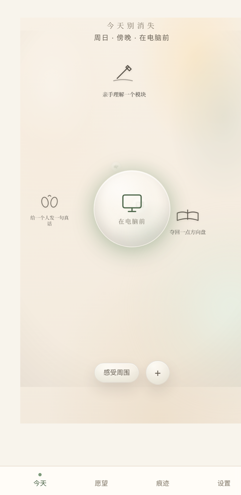
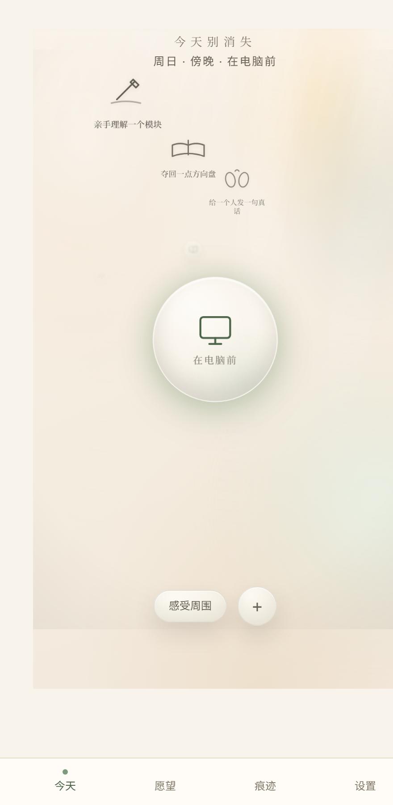
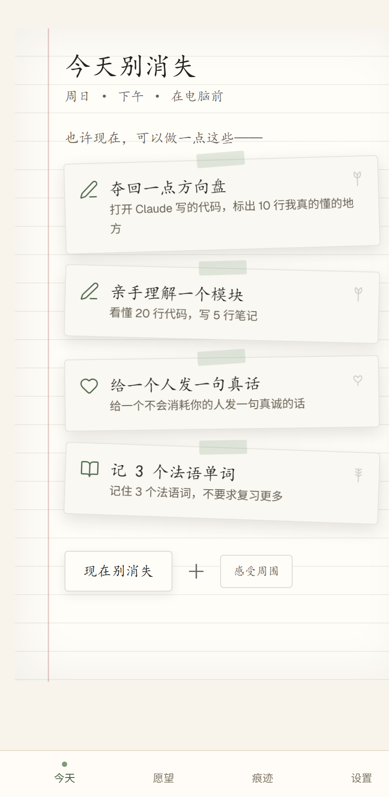

# Gallery — the skins on main

All three looks share one core; only the Home skin differs (config:
`NEXT_PUBLIC_AESTHETIC`). Reshoot with `bash scripts/shoot-home.sh <skin>`.

## glass — liquid-glass bubble field

## ocean — buoyancy (wishes float to the surface)

## paper — warm field-notebook

