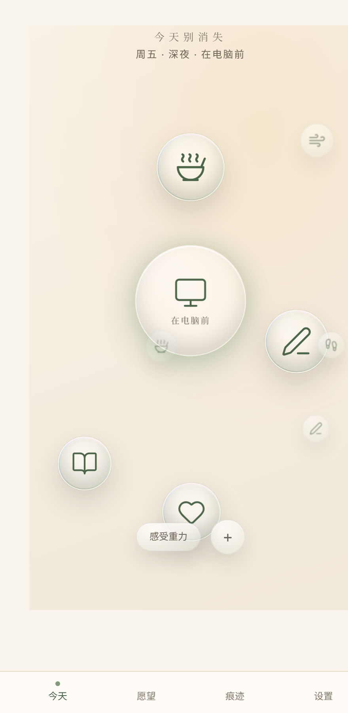
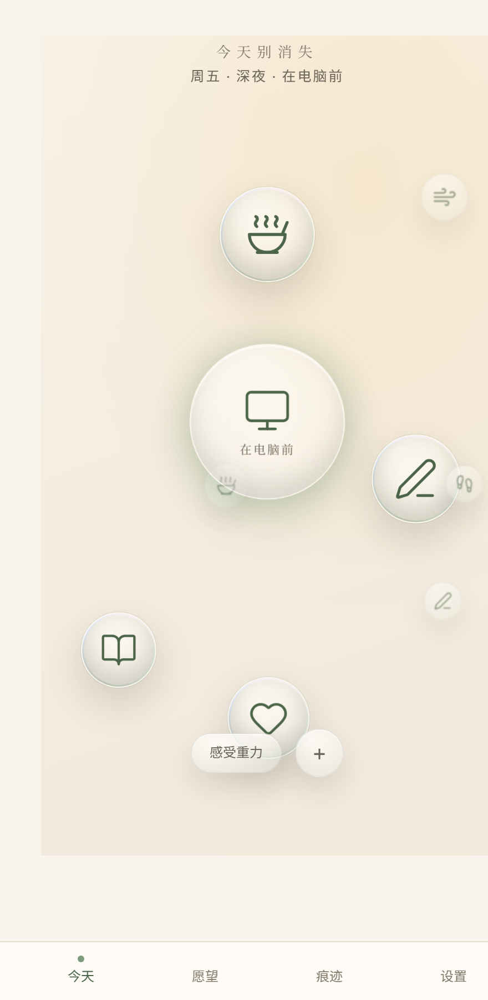

# Gallery — latest Home look per direction

Each overnight tick screenshots the (clean) Home for its direction so you can
compare the three the next morning. Updated by `scripts/shoot-home.sh <dir>`.

## A · Liquid Glass

## B · Living World

## C · Calm Ritual

_(All three start from the same baseline; they diverge as the loop explores each
direction. See `docs/overnight-plan.md` and `docs/TIMELINE.md`.)_
