# An illustrated tour of the codebase

*What each part does, which functions do it, and what it looks like running.*
Companion to [`README.md`](README.md) (facts) and [`VISION-AUDIT.md`](VISION-AUDIT.md)
(why). All screenshots live in [`shots/`](shots/).

---

## 1 · The one loop everything serves

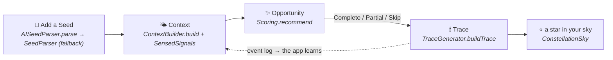

A *Seed* is a soft wish; a *Trace* is "today didn't disappear, because ___".
Partial always counts. Skips never shame. The loop's history feeds back into
tomorrow's context — that's the whole intelligence.

---

## 2 · The home, annotated

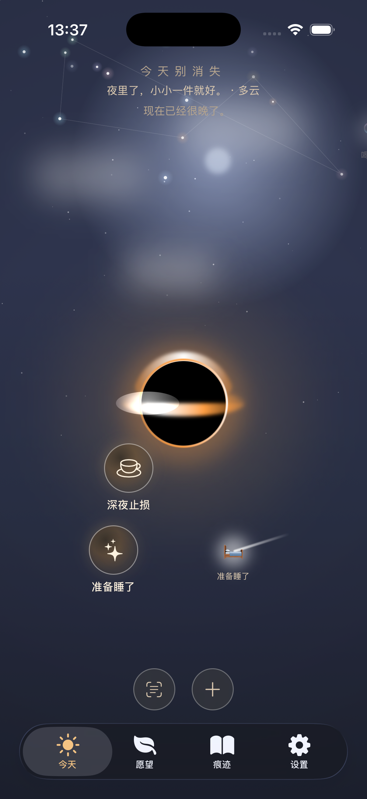

| what you see | function that draws it |
| --- | --- |
| the black hole (shadow, lensed disk, photon ring, Doppler side) | `HomeView.blackHoleVisual` — physics in [`PLANETARIUM-PHYSICS.md`](PLANETARIUM-PHYSICS.md) |
| wishes orbiting it | `OrbitSim.step` — velocity-Verlet gravity sim; Kepler's 3rd law falls out of `μ` |
| device tilt bending orbits | `OrbitSim` rest-pose baseline (EMA) + weak ring spring — only an *active lean* perturbs |
| **the stars** — one per trace, tinted by category | `ConstellationSkyView` + `ConstellationSky.position/tint` (stable hash → your sky never rearranges) |
| the faint line joining recent stars | the week's constellation, same view |
| shooting stars carrying suggestions | `HomeView.shootingStars` + `Suggester.suggest` / `SuggestAI.moments` |
| a star with a place label ("图书馆 · 200m") | `OpportunityScout.scout` — an active wish × a fitting place within a short walk |
| completing a wish: infall → ring flare → jet → star bloom (~2.6 s) | `BirthOverlay` (triggered in `HomeView.complete`) |

Daylight version, with the scout live and real weather in the day-line:

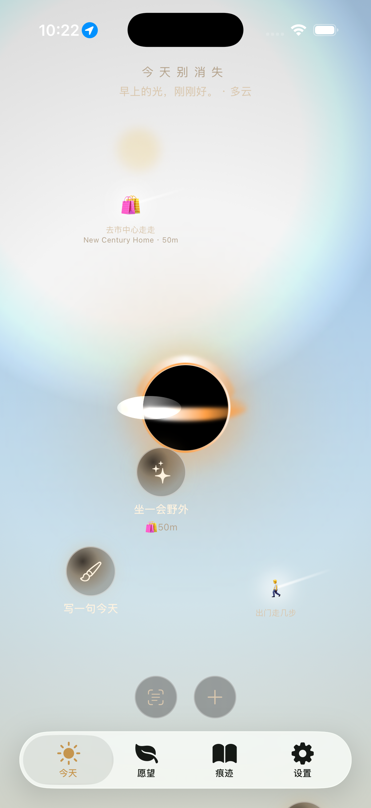

---

## 3 · The scoring spine (the auditable heart)

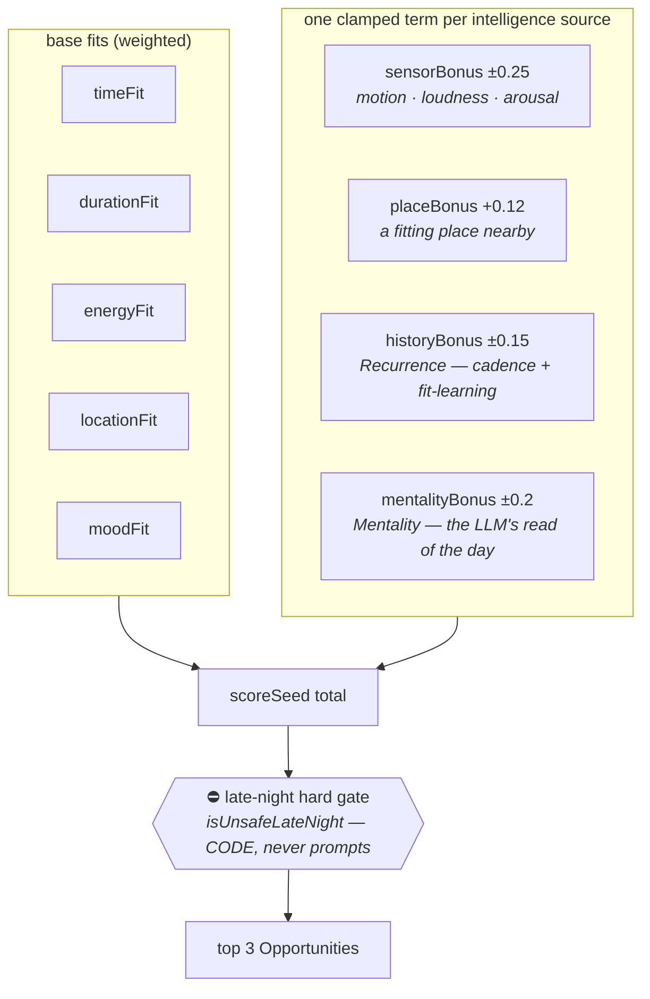

Everything lives in `Scoring.swift` (+ `Recurrence.swift`, `Mentality.swift`).
The law: **new signals may only add one clamped term**. The late-night gate is
pinned by three tests in `CoreTests/` that fail if it ever weakens.

---

## 4 · Awareness — how the app knows the moment

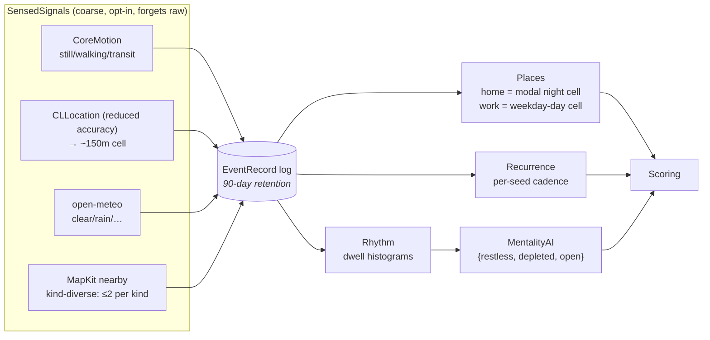

The sensed day-line, live on the home (`·多云`, walking state, nearby kinds):

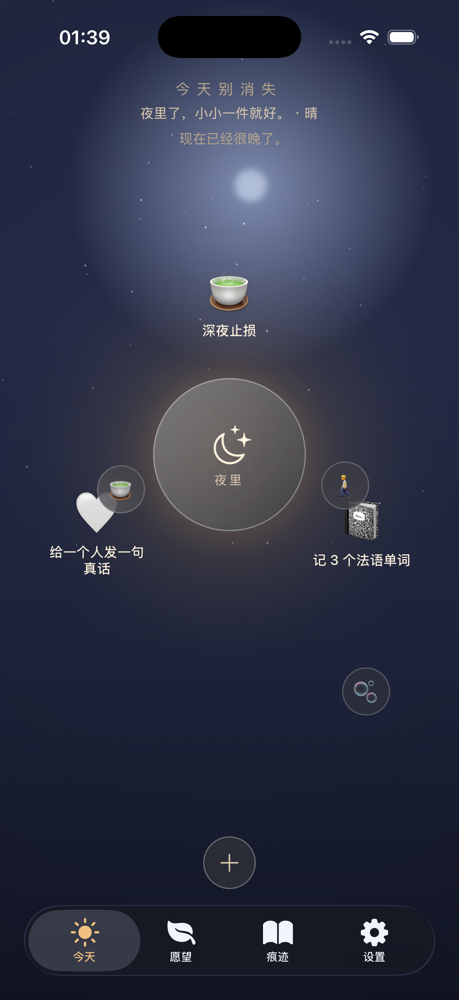

---

## 5 · On-device LLM — the pair of hands

Every feature follows one pattern (the `LearningMerge` pattern):
**`@Generable` structured output → closed-set validation → `ForbiddenWords`
filter → deterministic fallback**. The LLM decides *content*; code decides
*truth and safety*. All of it is Apple FoundationModels, on the device.

| you tap | what happens | where |
| --- | --- | --- |
| 轻轻接住 (plant a wish) | raw text → full structured seed | `AISeedParser` |
| 帮我把它拆小 | 2–4 tiny steps, each with a live resource (route / vocab / photo / breath) | `TaskPlannerAI` + `PlanKit` + `PlanView` |
| 帮我想一道菜 | dish → ingredient checklist → 抄走清单 → nearest market **with walking route** | `RecipeExecutor` + `RouteFinder` |
| 挑三个法语词 (+ theme chips grown from your day) | themed vocab, history-aware | `AILesson` + `LanguageScenarios` |
| 复习一个学过的词 | 3-option quiz from your oldest words | `ExecutorViews.ReviewQuizView` |
| 拍照翻译 | photo → OCR (any language) → English + 中文 | `Translate` + `TranslateView` |
| 给我一个开头 / 帮我起一句真话 | one line for creation / connection (copy-only, never sends) | `ExecutorViews.SparkLineView` |
| 回看这一周 | one warm paragraph from the week's traces | `WeekReview` |
| *(invisible)* | mentality estimate, reason phrasing, merge judgment, moment suggestions | `MentalityAI` `SuggestAI` `LearningLog` |

> The Simulator has no Apple Intelligence — every row above silently degrades
> to its fallback there. Demo them on a device.

---

## 6 · Storage — gardens

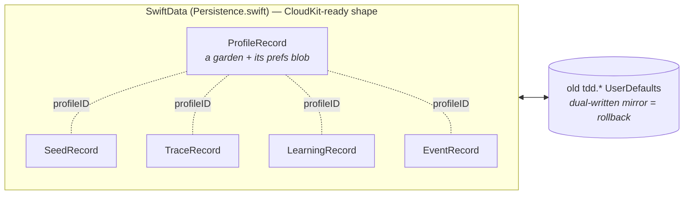

Records are payload-JSON hybrids: the Codable structs in `Domain.swift` stay the
domain currency, so struct evolution never forces a schema migration. Several
gardens on one device (Settings → 花园, `AppStore.switchGarden`); the watch
keeps plain UserDefaults.

---

## 7 · Three skins, three platforms

| glass (planetarium) | ocean | paper |
| --- | --- | --- |
| 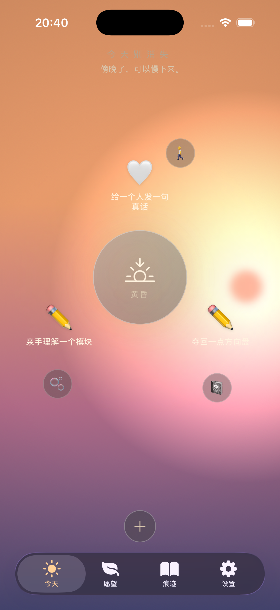 | 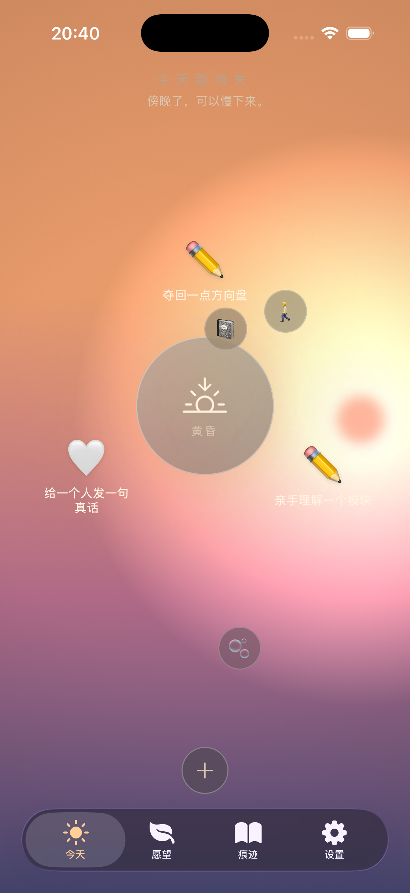 | 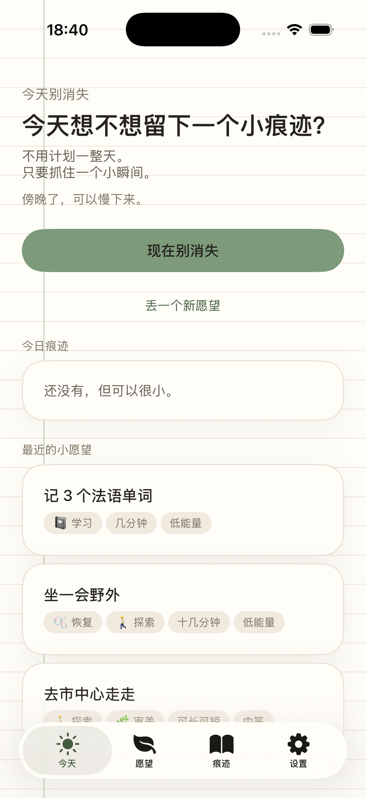 |

Runtime-switchable in Settings → 外观风格 (`AppStore.setAesthetic`), each with
its own theme music (`SkinMusic`, credits in [`MUSIC-CREDITS.md`](MUSIC-CREDITS.md));
自动 follows Dark/Light. Same core runs the watch:

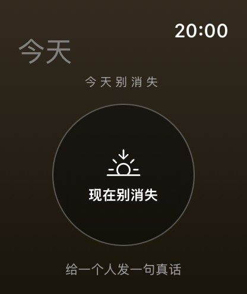

---

## 8 · Try the demos yourself

```bash
cd ios && swift test        # 49 tests — the safety rules, pinned
open Luminous.xcodeproj     # scheme "Luminous" → iPhone simulator
```

- **See the constellation without living two weeks first** (Simulator, DEBUG):
  `xcrun simctl launch <udid> rainymushroom.Luminous -demoStars`
  (a night timezone helps: prefix `SIMCTL_CHILD_TZ=Asia/Tokyo`).
- **The birth ceremony**: complete any wish in the glass skin.
- **Everything LLM**: run on an iPhone with Apple Intelligence enabled.
